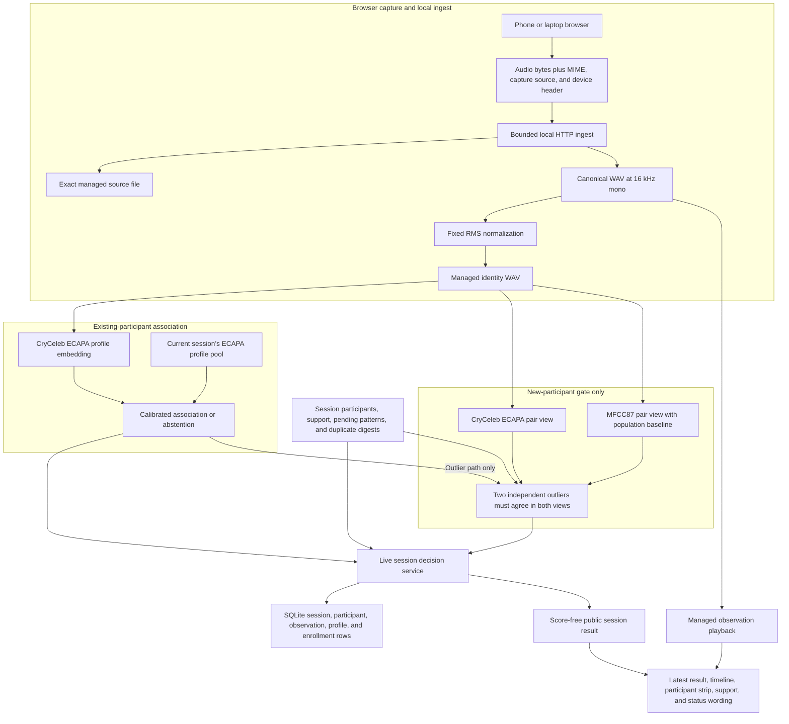
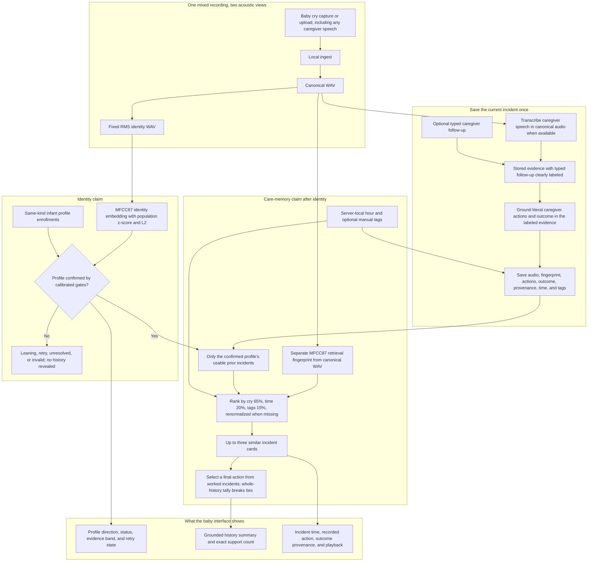

# Cry Memory

Cry Memory is a working local hackathon demonstration of interaction memory with two connected
ideas:

1. A live human cry-imitation session builds a score-free participant map from separate short
   recordings.
2. Baby mode uses a confirmed acoustic profile to retrieve only that baby's prior caregiver
   history.

It is a memory aid, not a cry translator. It does not diagnose why someone is crying.

## Clone and run on macOS

The complete phone path documented here has been exercised with a Mac laptop and an iPhone. The
localhost path may also work on Linux, but the certificate and iPhone trust instructions below are
macOS-specific.

Prerequisites:

- macOS with Command Line Tools, which supplies `git`;
- Homebrew;
- internet access for the first dependency install, public corpus clone, browser-test download,
  and acoustic-model checkpoint download;
- an iPhone and Mac on the same local network for the phone path, with client-to-client traffic
  allowed;
- free disk space for the Python environment, public corpus, model checkpoint, and managed audio.

Install the command-line dependencies:

```bash
xcode-select -p
brew install uv ffmpeg node
uv --version
ffmpeg -version
ffprobe -version
```

If `xcode-select -p` reports that the tools are missing, run `xcode-select --install`, finish the
macOS installer, and then repeat the checks.

Clone the repository, create the required Python 3.12 environment, install dependencies, clone the
public cry corpus at the path expected by `tools/build_baseline.py`, and build the population
normalization baseline:

```bash
git clone https://github.com/Prasshanna-S/interaction-memory.git
cd interaction-memory
uv venv .venv --python 3.12
. .venv/bin/activate
uv pip install -r requirements.txt
git clone --depth 1 \
  https://github.com/gveres/donateacry-corpus.git \
  experiments/donateacry-corpus
.venv/bin/python tools/build_baseline.py
```

Do not install `librosa`. This project deliberately uses NumPy and SciPy for its local acoustic
path. The baseline command must finish with `population baseline saved`; without that baseline,
infant retrieval correctly refuses to compare raw MFCC87 vectors.

### Laptop-only server

Start the local desktop server:

```bash
.venv/bin/python -m src.http_api \
  --http \
  --host 127.0.0.1 \
  --port 8000 \
  --data-root data/audio \
  --static-root web \
  --db data/episodes.db
```

On first start, the process downloads the human acoustic checkpoint into `models/`. It warms the
required encoders before it starts serving. Wait for a line like this:

```text
Cry Memory ready at http://127.0.0.1:8000 with encoders {'ecapa-cryceleb-v1': True, 'mfcc87-v1': True}
```

Dictionary order is not significant. A `False` value means that encoder did not warm and should
be investigated before the demonstration. Once the ready line appears, open
[http://127.0.0.1:8000](http://127.0.0.1:8000) and confirm the health response:

```bash
curl http://127.0.0.1:8000/api/health
```

### iPhone over trusted local HTTPS

Plain HTTP at a LAN address is not a secure browser context and cannot be relied on for iPhone
microphone capture. Generate a certificate for the Mac's current LAN IP and fully trust its
temporary local certificate authority on the iPhone.

For Wi-Fi on the tested Mac configuration, print the address with:

```bash
ifconfig en0 | awk '/inet / {print $2}'
```

Use the non-loopback address, such as `10.21.6.4`. If `en0` has no address, find the active
interface in System Settings under Network, or inspect the `inet` lines from `ifconfig`. Do not use
`127.0.0.1`. Replace `10.21.6.4` in the commands and URLs below with the current address:

```bash
.venv/bin/python spikes/mobile_capture/make_cert.py 10.21.6.4

.venv/bin/python spikes/mobile_capture/bootstrap.py \
  --host 0.0.0.0 \
  --port 8080 \
  --cert data/audio/mobile-capture-spike/certs/rootCA.pem
```

With the bootstrap server running, open this exact URL in Safari on the iPhone:

```text
http://10.21.6.4:8080/Interaction-Memory-Spike-CA-corrected.mobileconfig
```

Then:

1. Allow the configuration profile to download.
2. Open Settings. Select **Profile Downloaded**, or go to **General > VPN & Device Management**,
   select **Interaction Memory Local Spike CA**, and install it. Enter the device passcode and
   acknowledge the certificate warning.
3. Go to **General > About > Certificate Trust Settings**.
4. Enable full trust for **Interaction Memory Local Spike CA** and confirm.
5. Stop the bootstrap server with Control-C.

The profile contains only the public root certificate. Do not copy or serve `rootCA.key` or
`server.key`. The generated certificates expire after 30 days. If the Mac's LAN IP changes,
regenerate the certificate for the new IP and repeat installation and trust.

Start the production HTTPS service:

```bash
.venv/bin/python -m src.http_api \
  --host 0.0.0.0 \
  --port 8443 \
  --data-root data/audio \
  --static-root web \
  --db data/episodes.db \
  --cert data/audio/mobile-capture-spike/certs/server.pem \
  --key data/audio/mobile-capture-spike/certs/server.key
```

Wait for the ready line and confirm both encoder values are `True`. Open
`https://10.21.6.4:8443` on the iPhone. The page should load without a certificate warning and the
header should say `Local server ready`. Allow microphone access when prompted. A browser warning
usually means the phone does not fully trust the root, the URL uses a different IP from the
certificate, or a captive or isolated network is interfering.

The [demo operator runbook](docs/DEMO-READY.md) covers rehearsal, presentation order, fallbacks,
and certificate cleanup.

## Clone and run on Windows 10 or Windows 11

The Windows lane uses native PowerShell and does not activate the virtual environment. The scripts
resolve every runtime path from their own repository location, so a checkout path containing spaces
is supported.

Requirements:

- 64-bit Windows 10 version 1809 or later, or Windows 11;
- Windows PowerShell 5.1 or PowerShell 7;
- WinGet through the Windows App Installer;
- internet access during tool installation, dependency installation, corpus clone, and the first
  acoustic-model warm-up;
- a Private local network that allows phone-to-computer traffic for the optional iPhone path.

Install Git first:

```powershell
winget install --id Git.Git --exact --source winget
```

On a clean computer, close that PowerShell window after WinGet finishes and open a new one. A
running shell does not receive PATH changes made by an installer. Confirm that the new shell can
find Git, then clone the repository and run the native setup:

```powershell
git --version
git clone https://github.com/Prasshanna-S/interaction-memory.git
Set-Location ".\interaction-memory"
.\scripts\setup_windows.ps1 -InstallTools
```

If setup installs a tool, close PowerShell, open a new PowerShell window, return to the repository,
and run setup again. It installs a managed Python 3.12, creates `.venv`, installs Python
dependencies without activation, checks `ffmpeg` and `ffprobe`, clones the public corpus at the
required path, and builds the population baseline. It is safe to rerun.

On Windows 11, include the optional browser interaction dependency:

```powershell
.\scripts\setup_windows.ps1 -InstallTools -InstallPlaywright
```

Keep `-InstallTools` on this command so setup can install Node when it is absent. Current Playwright
releases do not list Windows 10 as a supported host. The core Cry Memory server does not require
Playwright.

If PowerShell policy blocks a checked-out script, use a one-process bypass without changing the
machine-wide policy:

```powershell
powershell.exe -NoProfile -ExecutionPolicy Bypass -File .\scripts\setup_windows.ps1 -InstallTools
```

### Windows desktop HTTP

Start the desktop server:

```powershell
.\scripts\run_windows.ps1 -Mode Desktop
```

The first start may download the acoustic checkpoint. Wait until the ready line reports both
encoder values as `True`. In a second PowerShell window:

```powershell
Set-Location ".\interaction-memory"
.\scripts\run_windows.ps1 -Mode Health
Start-Process "http://127.0.0.1:8000"
```

Desktop HTTP binds only to `127.0.0.1`. It is suitable for the browser on the same computer, but
not for an iPhone microphone. On the Windows computer, the loopback page can use the browser
microphone as the primary input. Use the page's audio-file upload as the fallback when microphone
permission, the selected input device, or room acoustics are unsuitable.

### Windows iPhone HTTPS

The phone and Windows computer must be on the same trusted local network. Find the current IPv4 LAN
address and verify that it is not `127.0.0.1`:

```powershell
$LanIp = (
    Get-NetIPConfiguration |
    Where-Object { $_.IPv4DefaultGateway -and $_.NetAdapter.Status -eq "Up" } |
    Select-Object -First 1
).IPv4Address.IPAddress
$LanIp
```

The portable certificate entry point is:

```powershell
& .\.venv\Scripts\python.exe .\spikes\mobile_capture\make_cert.py $LanIp
```

The launcher calls that entry point automatically, then serves the installable iPhone profile:

```powershell
.\scripts\run_windows.ps1 -Mode Bootstrap -LanIp $LanIp
```

If Windows asks about firewall access, allow Python only on Private networks. On the iPhone, open
the exact URL printed by the script, then:

1. allow the configuration profile to download;
2. open **Settings > General > VPN & Device Management** and install
   **Interaction Memory Local Spike CA**;
3. open **Settings > General > About > Certificate Trust Settings**;
4. enable full trust for **Interaction Memory Local Spike CA**;
5. stop the bootstrap server with Control-C.

Start the HTTPS product server:

```powershell
.\scripts\run_windows.ps1 -Mode Phone -LanIp $LanIp
```

Wait for both encoders to report `True`, then open `https://WINDOWS-LAN-IP:8443` on the iPhone and
allow microphone access. Regenerate and reinstall the certificate whenever the computer's LAN IP
changes. Never share `rootCA.key` or `server.key`, and remove the temporary profile from the iPhone
after the demonstration.

### Windows troubleshooting

- **A command is missing after WinGet succeeds:** close every PowerShell window, open a new one,
  return to the repository, and rerun setup. Confirm `git`, `uv`, `ffmpeg`, and `ffprobe`
  individually with `--version`. Node and npm are needed only for the optional browser test.
- **Setup finds the wrong Python:** the scripts require `.venv\Scripts\python.exe` to report Python
  3.12. Remove only this repository's `.venv` directory and rerun setup.
- **The corpus directory exists but baseline setup stops:** remove or rename the incomplete
  `experiments\donateacry-corpus` directory, then rerun setup. The expected nested directory is
  `donateacry_corpus_cleaned_and_updated_data`.
- **An encoder reports `False`:** keep internet access available, confirm Python dependencies import,
  and restart the server. Do not present until both encoders warm.
- **The phone cannot connect:** confirm the network is marked Private, allow inbound TCP 8080 and
  8443 for Python, disable client isolation, and use the same LAN IP that was embedded in the
  certificate.
- **The phone shows a certificate warning:** install the profile and enable full trust as two
  separate steps. If the IP changed, rerun Bootstrap and reinstall the new profile.
- **The repository path contains spaces:** invoke scripts with the call operator and a quoted path,
  for example `& "C:\Demo Files\interaction-memory\scripts\run_windows.ps1" -Mode Desktop`.

## Fastest human demonstration

1. Choose **Human cry imitation**.
2. Press **New session**.
3. Record with the microphone or select an audio file. A microphone stop or file selection
   submits one independent recording automatically.
4. The first usable recording creates dotted provisional **Person A** with one supporting
   recording.
5. A separately captured recording that passes the acoustic association gate reinforces Person A.
   The bubble becomes solid and established.
6. A safe outlier from a later person shows **Possible new person** without creating a bubble.
   A second separately captured outlier must agree with that pending acoustic pattern before the
   service creates established Person B. The same rule creates Person C and later labels.
7. Every accepted observation remains in the timeline with managed playback.
8. Pass the phone or laptop to the next participant and repeat.

Starting a new live session does not delete earlier sessions, human profiles, baby profiles, or
caregiver history. It creates a new independent session view. A managed recording used in an
earlier session can be submitted again; byte-duplicate protection remains active within the
current session.

### What the human statuses mean

| Public status | Interface meaning | Profile change |
|---|---|---|
| `provisional_created` | New dotted Person A pattern | Creates provisional Person A with support 1 |
| `participant` | Repeated pattern for a named participant | Reinforces an existing participant or creates a later participant from two agreeing pending recordings |
| `possible_new` | Possible new person; another independent recording is needed | No participant and no reinforcement |
| `leaning` | Direction toward a named participant, not confirmed | No reinforcement |
| `duplicate` | The managed identity-audio digest was already submitted in this live session | Timeline event remains, support does not change |
| `invalid` | Recording not used, with the backend reason shown for empty, unsupported, corrupt, silent, or unusable audio | No participant change |
| `session_completed` | The current session is closed | No new observation |

The public API and interface do not expose a score, margin, similarity, embedding, digest, or
filesystem path. A cosine similarity is not a probability.

## Measured live-session evidence

The current evaluator used the real HTTP routes, upload checks, ffmpeg ingest, managed files,
both human acoustic encoder views, session state machine, and SQLite persistence. Each mode used
a fresh temporary database, managed-audio root, and HTTP server. Truth labels stayed inside the
evaluator and were applied only after each response returned.

The orders are fixed synthetic arrival orders. The manifest has no global capture chronology.

| Metric | One person | Staged three person | Difficult three person |
|---|---:|---:|---:|
| Valid observations | 5/5 | 10/10 | 10/10 |
| Represented people | 1/1 | 3/3 | 3/3 |
| Participants created | 1/1 | 3/3 | 3/3 |
| Correct established assignments | 4/4 | 5/5 | 5/5 |
| Correct directional assignments | 0/0 | 2/2 | 2/2 |
| Direction coverage after a reference existed | 4/4 | 7/9 | 7/9 |
| Correct direction when shown | 4/4 | 7/7 | 7/7 |
| Wrong named directions | 0/4 | 0/7 | 0/7 |
| Known-person splits | 0 | 0 | 0 |
| Duplicate profiles | 0 | 0 | 0 |
| `possible_new` observations | 0 | 2 | 2 |
| Pending patterns at end | 0 | 1 | 1 |
| Reinforcements | 4 | 5 | 5 |
| Maximum observation latency | 3.513 s | 8.032 s | 11.525 s |

The staged and difficult release gates both passed:

```text
represented_people = 3
participants_created = 3
wrong_person = 0
duplicate_profiles = 0
known_person_split = 0
```

Perfect direction coverage is not claimed. In each three-person order, two observations remained
`possible_new`. One hard Second person recording later produced a correct direction toward
Person B but did not reinforce Person B. The pending pattern remained unresolved instead of
creating Person D.

The separate probes also passed:

| Probe | Measured result |
|---|---|
| Exact duplicate | HTTP 201 with `duplicate`; support stayed 1; both timeline rows remained |
| Corrupt bytes with `audio/wav` | HTTP 422 with `invalid`; participant state and two-row timeline stayed unchanged |

Exact per-observation public responses, reason codes, participant snapshots, truth bindings, and
nanosecond latencies are in
[`demo_assets/human_audio/live-session-results.json`](demo_assets/human_audio/live-session-results.json).

### Manual UI observation, not an automated metric

In a separate live UI check, the user reported that the female participant audio and a
phone-replayed version of the user's own cry repeatedly formed distinct session patterns. This
observation has no controlled numerator or denominator and is not included in the automated
metrics.

It demonstrates separation in that tested session under those channel conditions. It does not
demonstrate channel-invariant person recognition or estimate population performance.

### Reproduce the evidence

All ten recordings are already included. No separate audio download is needed.

```bash
.venv/bin/python tools/live_session_eval.py \
  demo_assets/human_audio/manifest.json --mode one-person

.venv/bin/python tools/live_session_eval.py \
  demo_assets/human_audio/manifest.json --mode staged

.venv/bin/python tools/live_session_eval.py \
  demo_assets/human_audio/manifest.json --mode difficult

.venv/bin/python tools/live_session_eval.py \
  demo_assets/human_audio/manifest.json --mode probes
```

`--mode alternating` is an alias for the difficult order. To regenerate one gated JSON bundle:

```bash
.venv/bin/python tools/live_session_eval.py \
  demo_assets/human_audio/manifest.json \
  --mode all \
  --output demo_assets/human_audio/live-session-results.json
```

The evaluator mechanically checks all ten files for presence, supported MIME, positive duration,
byte size, unique SHA-256, and manifest agreement before it starts a session.

## Evidence limits

- The human evidence is 10 correlated recordings from 3 consenting adult cry imitators.
- Every recorded participant agreed on 2026-07-30 to public distribution of these 10 recordings.
- The cohort mixes WAV and M4A containers and capture channels.
- The two evaluation orders are synthetic, not known capture chronology.
- These counts are demonstration evidence, not population accuracy.
- Adult imitation results do not establish infant identity performance.
- A second recording adds supporting evidence. It does not prove identity.
- Measured latency depends on the laptop and concurrent CPU load. The saved maximums are evidence
  from one run, not a service-level guarantee.
- The system reports acoustic association or abstention. It does not infer a medical cause.

## Baby identity and personal care memory

Baby mode keeps acoustic identity separate from care retrieval:

1. Create at least two infant profiles.
2. Enroll three independent recordings for each profile.
3. Submit a held-out fourth recording through the same managed ingest path.
4. Compare it only with same-kind infant profiles using the local MFCC87 view and stored
   normalization baseline.
5. If the profile is confirmed, retrieve incidents only from that profile.
6. Rank those prior incidents using within-profile cry similarity plus explicit context.
7. Show a previously recorded caregiver action and the similar incidents that support this result.
   One supporting incident can be shown; the interface reports the exact count.
8. Let the caregiver complete the incident exactly once, with an optional typed follow-up. The
   audio transcript and typed follow-up can ground literal caregiver actions and the outcome.
   Stored evidence prefixes the text with `Typed caregiver follow-up:` instead of presenting it as
   transcribed speech.

Time, caregiver notes, prior incidents, and context may rank care memories after identity. They
never decide acoustic identity.

### Included Baby 1, Baby 2, and Baby 3 clips

Eighteen public-corpus rehearsal clips are checked in under
[`demo_assets/baby_audio`](demo_assets/baby_audio/README.md). Each labeled folder has six
independent source recordings with fixed roles:

- files `01`, `02`, and `03` are enrollments;
- file `04` is the held-out blind query;
- file `05` is the independent retry if the first query permits one;
- file `06` is an unused extra, reserved for rehearsal recovery.

```text
demo_assets/baby_audio/
├── baby-1/
├── baby-2/
└── baby-3/
```

The manifest preserves every original source filename, timestamp, contributor label, source
app-install UUID, duration, and SHA-256 digest. The source UUID represents one app installation,
not a verified infant, so Baby 1, Baby 2, and Baby 3 are demo proxy groups rather than confirmed
identity ground truth.

The infant thresholds were calibrated on room-replayed audio. For the intended identity
rehearsal, play every enrollment and query through the same speaker-to-microphone path without
changing volume, distance, room position, or microphone. Raw direct upload is useful for checking
ingest and playback, but these 8 kHz fixtures are not calibrated as a direct-upload identity test.
The [fixture runbook](demo_assets/baby_audio/README.md) gives the exact sequence and the
[data notice](demo_assets/baby_audio/LICENSE-DATA.md) preserves attribution and license links.

### Synthetic care-memory history for the demonstration

The fixture recordings establish only the acoustic rehearsal. They do not contain real caregiver
history. After profiles named exactly `Baby 1`, `Baby 2`, and `Baby 3` each have their three
enrollment WAVs, seed the local care-memory demonstration:

macOS or Linux:

```bash
.venv/bin/python scripts/seed_demo_memory.py
```

Windows:

```powershell
& .\.venv\Scripts\python.exe .\scripts\seed_demo_memory.py
```

The script maps those three exact profile names automatically and creates six synthetic prior
episodes per profile. Re-running it fills only missing seed slots and leaves real caregiver history
untouched. `--db` and `--data-root` are available only for advanced setups that use custom paths.

Every seeded intervention, outcome, and apparent success is synthetic demonstration history. It is
marked with seed provenance in storage and the interface. It is not a caregiver report, clinical
evidence, or evidence that any action works. The live identity result is still computed from the
rehearsal recording.

Run the real baby identity and care-memory checks:

```bash
.venv/bin/python -m unittest tests.test_product_real_audio_api -v
```

## Architecture

The [full system mind map and end-to-end data flow](docs/SYSTEM-FLOW.md) shows every current input,
decision gate, storage boundary, and caregiver-facing output. It also separates signals used now
from candidate future signals.

### Which data builds which result

| Result | Inputs used now | Inputs not used for this result | What the browser shows |
|---|---|---|---|
| Human participant direction | Normalized identity audio; CryCeleb ECAPA comparison against the current session; calibrated gates; participant, support, duplicate, and pending-pattern state. MFCC87 joins ECAPA only for the two-recording new-person consistency gate. | Time, tags, caregiver actions, outcomes, and baby care history | Person label, provisional or established state, matched, leaning, or possible-new wording, support count, timeline, and playback. No score is shown. |
| Infant identity direction | Normalized identity audio; MFCC87; population z-score and L2 normalization; same-kind infant enrollments; calibrated match, margin, and retry gates | Time, tags, caregiver actions, outcomes, and all other profiles' care history | Profile direction, ordinal evidence band, retry, unresolved, or invalid state. No probability is shown. |
| Similar incident ranking | A separate MFCC87 care-retrieval fingerprint computed from canonical audio; confirmed profile; server-local hour at preview or completion; optional manual tags; only that profile's usable prior incidents | Other profiles, the current follow-up entered after preview, capture metadata, and any inferred cause | A grounded summary and up to three supporting incident cards with time, recorded action, outcome provenance, ordinal acoustic band, and playback. Raw component scores and tags are not shown. |
| What helped before | Worked incidents among the top three ranked scenarios; each incident's final recorded action; whole-profile final-action tally as a tie-breaker; recorded outcomes and provenance | New treatment generation, diagnosis, and unsupported actions | One prior action when available, the exact supporting incident count, recorded outcomes, incident times, provenance, and playback. A single supporting incident can be reported. |
| Current incident record | Canonical audio; caregiver speech transcript; optional typed caregiver follow-up; literal actions and outcome grounded in that labeled evidence; server completion time; manual tags | Medical cause and client capture time | Save status and the new incident card. Stored evidence prefixes typed text with `Typed caregiver follow-up:` instead of passing it off as speech. The full evidence text and tags are not displayed. |

Time, tags, actions, outcomes, and care history never decide identity. No current input decides why a
person or baby cried. Feeding, sleep, diaper, motion, room calibration, temperature, and wearable
data are not currently collected or used. They appear in the full map only as candidate future
inputs.

The browser request includes the audio body, content type, capture source, and an
`X-Capture-Device` value that currently contains the browser user agent. Retention is path-specific:
live observations store capture source, managed paths, and a digest; accepted enrollments store the
device string; baby attempts retain nested ingest metadata. The original upload filename is not
sent, and a separate user-agent field is not retained consistently. None of this metadata
strengthens identity or care-memory ranking.

### Human incremental identity



### Baby identity and care memory



Neither path computes a cause, diagnosis, treatment confidence, or probability. The identity path
answers which enrolled profile the recording resembles. The care path answers what was recorded in
that confirmed profile's own similar history.

### Phone versus laptop

| Runs in the phone or laptop browser | Runs on the laptop server |
|---|---|
| Microphone capture | Upload bounds and MIME validation |
| Audio file selection | ffmpeg decode to canonical WAV |
| New session, start, stop, and submission controls | Fixed RMS normalization |
| Latest result, timeline, playback, participant strip | MFCC87 and CryCeleb encoding |
| Same-origin HTTP requests | Live-session decisions and SQLite persistence |
| No expected-person label | Baby retrieval, guidance, and outcome storage |

### Source modules

| Module | Responsibility |
|---|---|
| `web/index.html`, `web/app.js`, `web/app.css` | Capture controls, live result, timeline, playback, and responsive participant strip |
| `src/http_api.py` | Same-origin HTTP, ingest routing, public allowlists, and playback |
| `src/audio_ingest.py` | Bounded upload, MIME validation, ffmpeg decode, canonicalization, and fixed normalization |
| `src/encoders.py` | MFCC87 and CryCeleb ECAPA adapters |
| `src/identity.py` | Profiles, enrollments, same-kind identity, scoped identity, and pair consistency |
| `src/live_sessions.py` | Session labels, pending evidence, observations, state transitions, and reinforcement |
| `src/retrieve.py` | Confirmed-profile incident ranking |
| `src/guidance.py` | Caregiver-history-grounded action selection |
| `src/careflow.py` | Identity-to-memory preview and one-time completion |
| `src/store.py` | SQLite episode and baseline persistence |

### Live-session API

| Method and route | Success | Purpose |
|---|---:|---|
| `POST /api/live-sessions` | 201 | Create an independent session |
| `GET /api/live-sessions/{session_id}` | 200 | Load participants and timeline |
| `POST /api/live-sessions/{session_id}/observations` | 201 | Ingest and classify one recording |
| `POST /api/live-sessions/{session_id}/complete` | 200 | Close a session without deleting it |
| `GET /api/audio/live-observations/{observation_id}` | 200 | Play managed canonical observation audio |

Observation upload may also return 422 for invalid audio, 409 for a completed session, or 404 for
a missing session. A byte-identical duplicate within the current session remains a 201 timeline
event.

Baby and care-memory routes remain available:

```text
GET    /api/profiles
POST   /api/profiles
POST   /api/profiles/{id}/enroll
POST   /api/identity/attempts
POST   /api/identity/attempts/{id}/captures
POST   /api/identity/attempts/{id}/retry
POST   /api/incidents/{attempt_id}/preview
POST   /api/incidents/{attempt_id}/complete
GET    /api/audio/enrollments/{id}
GET    /api/audio/episodes/{id}
```

### Managed audio stages

| Stage | Managed artifact | Purpose |
|---|---|---|
| Upload accepted | `source.<ext>` | Exact received evidence |
| Decode succeeds | `canonical.wav` | Stable 16 kHz mono processing and playback source |
| Normalization succeeds | `identity.wav` | Fixed-level acoustic identity input. A digest is computed later when an observation, enrollment, or attempt capture is accepted. |
| Encoder runs | Persisted enrollment embedding; transient query embedding | Acoustic profile comparison. Query embeddings are not stored in SQLite. |
| Observation accepted | Session result and private managed-path associations | Timeline and audit |
| Public response | Labels, states, reasons, playback URL | UI without scores, paths, digests, or embeddings |

An invalid decode may leave the managed source file even when no canonical or identity file
exists. Unsupported MIME and empty uploads are rejected before a capture directory is created.

### SQLite tables

| Table | Responsibility |
|---|---|
| `episode` | Baby incident, context, caregiver action, outcome, audio, and provenance |
| `baseline` | Population or subject normalization statistics |
| `profile` | Baby or human acoustic profile |
| `enrollment` | Profile reference recording, digest, and embedding |
| `identity_query` | Internal identity audit |
| `identity_attempt` | Current baby or manual-profile attempt lifecycle |
| `identity_attempt_capture` | Attempt capture evidence |
| `live_identity_session` | Incremental session lifecycle |
| `live_identity_participant` | Stable session label, state, and support count |
| `live_identity_observation` | Timeline result, private managed paths, digest, and associations |

### Retained data

| Boundary | Retained locally | Returned publicly |
|---|---|---|
| Accepted observation | Source bytes, canonical WAV, identity WAV, identity-audio SHA-256 | No filesystem path or digest |
| Identity comparison | Enrollment embeddings; query audio path and digest; private score, margin, candidate, reason, and version audit. Query embeddings are transient. | Ordinal status, direction, band, and reason codes |
| Capture metadata | Live observations retain capture source; enrollments retain the current device string; baby attempts retain nested ingest metadata. Original upload filenames and a uniform user-agent field are not retained. | Capture metadata is not returned as claim evidence. |
| Live session | Participant mapping, support count, observation associations | Stable labels, state, support count, timeline, playback URL |
| Baby care memory | Profile-scoped incidents, context, audio-transcript and clearly labeled typed-follow-up evidence, grounded actions, outcome, provenance, and audio path | Grounded prior action, exact supporting incident count, outcome provenance, time, and playback |
| New live session | Earlier sessions, profiles, enrollments, baby incidents remain | Only the requested new session view |

Production use would need explicit retention periods, deletion controls, authentication, access
control, encryption, consent records, and a model-license review. The CryCeleb checkpoint is
CC-BY-SA-4.0 and its source dataset has additional CC-BY-NC-ND-4.0 restrictions.

## What to build next

1. Collect a verified infant-identity dataset with explicit participant and guardian consent.
2. Measure more phones, rooms, distances, microphones, speakers, and playback paths.
3. Evaluate more participants and longer sessions without tuning on this ten-file cohort.
4. Calibrate session clustering and add an explicit pending-pattern merge policy.
5. Use time, caregiver notes, prior incidents, and context only for care retrieval, never acoustic
   identity.
6. Add production retention, deletion, security, and consent controls before any real deployment.

## Verification

The evaluators use the checked-in consented adult-imitation fixtures. They exercise different
state machines and should not be treated as population-level identity measurements.

Run every current incremental HTTP evaluator mode:

```bash
.venv/bin/python tools/live_session_eval.py \
  demo_assets/human_audio/manifest.json --mode one-person
.venv/bin/python tools/live_session_eval.py \
  demo_assets/human_audio/manifest.json --mode staged
.venv/bin/python tools/live_session_eval.py \
  demo_assets/human_audio/manifest.json --mode difficult
.venv/bin/python tools/live_session_eval.py \
  demo_assets/human_audio/manifest.json --mode probes
```

Run all gated incremental modes in one process and write a disposable report:

```bash
.venv/bin/python tools/live_session_eval.py \
  demo_assets/human_audio/manifest.json \
  --mode all \
  --output /tmp/cry-memory-live-session-results.json
```

Run the earlier named-profile evaluator in each supported mode:

```bash
.venv/bin/python tools/human_session_eval.py \
  demo_assets/human_audio/manifest.json --mode demo
.venv/bin/python tools/human_session_eval.py \
  demo_assets/human_audio/manifest.json --mode loo
.venv/bin/python tools/human_session_eval.py \
  demo_assets/human_audio/manifest.json --mode discovery
```

Validate the checked-in baby fixture manifest, file hashes, and WAV properties:

```bash
.venv/bin/python -m unittest tests.test_baby_demo_assets -v
```

Run the focused certificate, live-session, browser-contract, and real-audio integration suites:

```bash
.venv/bin/python -m unittest \
  tests.test_mobile_capture_spike \
  tests.test_product_real_audio_api.RealAudioProductApiTests.test_incremental_live_session \
  tests.test_live_session_http \
  tests.test_live_identity_sessions -v
```

Run the complete Python suite:

```bash
.venv/bin/python -m unittest discover -s tests -v
```

The browser interaction test additionally needs Playwright and its Chromium build. Install them
locally once, without creating a package manifest or lock file, then run the interaction and syntax
checks:

```bash
npm install --no-save --package-lock=false playwright
npx playwright install chromium
node tests/test_live_session_browser.mjs
node --check web/app.js
```

On Windows, use the managed interpreter directly and write disposable evidence under the Windows
temporary directory:

```powershell
$Py = (Resolve-Path .\.venv\Scripts\python.exe).Path

foreach ($Mode in "one-person", "staged", "difficult", "probes") {
    & $Py .\tools\live_session_eval.py .\demo_assets\human_audio\manifest.json --mode $Mode
}

$Report = Join-Path $env:TEMP "cry-memory-live-session-results.json"
& $Py .\tools\live_session_eval.py .\demo_assets\human_audio\manifest.json --mode all --output $Report

foreach ($Mode in "demo", "loo", "discovery") {
    & $Py .\tools\human_session_eval.py .\demo_assets\human_audio\manifest.json --mode $Mode
}

& $Py -m unittest discover -s tests -v
node --check .\web\app.js
```

On Windows 11 with Playwright installed, also run:

```powershell
node .\tests\test_live_session_browser.mjs
```

The complete decision, display, storage, and future-signal map is in
[`docs/SYSTEM-FLOW.md`](docs/SYSTEM-FLOW.md). Lower-level route and failure boundaries are in
[`docs/ARCHITECTURE.md`](docs/ARCHITECTURE.md). The presentation and cleanup sequence is in the
[`demo operator runbook`](docs/DEMO-READY.md).
