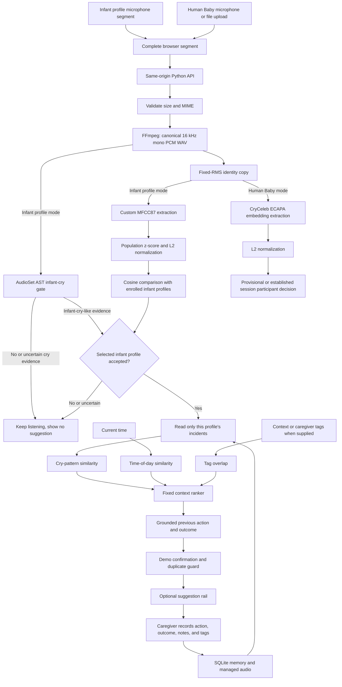

# SootheTrace

SootheTrace is a browser-based memory aid for caregivers. It listens in short
segments, checks for infant-cry-like audio, compares accepted audio with a
selected profile, and can surface a grounded reminder such as:

> What helped before: held baby upright.

The reminder comes from that profile's recorded care history. It is not a cry
translation, diagnosis, confidence score, or claim about why a baby is crying.
SootheTrace is a proof of concept, not a medical device, emergency service, or
unattended monitor.

## Inspiration

Anyone who knows Prasshanna knows how much he loves his nephew. His nephew is even the wallpaper on
his phone. Watching him grow toward his second birthday has brought the whole family a lot of joy,
but the road there has not always been easy.

There were endless nights of crying. Prasshanna would see his sister exhausted after trying one
thing after another to settle the baby. Sometimes she was too tired even to answer a call. The
family slowly learned what might help, but those small lessons were easy to forget during the next
stressful night.

That experience inspired a family-specific memory aid. During another difficult
night, the caregiver can see what helped in a similar earlier situation without
having to search through recordings or remember every detail.

## What is working

- A phone or desktop browser can record microphone audio continuously in
  complete 3-second segments.
- The interface shows server-confirmed infant-cry feedback before profile
  comparison or a suggestion.
- Demo Baby can retrieve one of three distinct care suggestions from six
  clearly synthetic incidents.
- A suggestion can be dismissed and reopened without stopping the recording.
- Landscape mode presents the suggestion, reasoning, and prior incidents as a
  horizontally swipeable card rail.
- History can show prior incidents, source-labelled stored transcripts, actions,
  outcomes, and playable managed audio when available.
- Human Baby runs a separate open-session experiment for adult cry imitations.
- The same browser and Python service can run locally or behind one hosted HTTPS
  origin.

There is no public hosted URL at this time.

## Three profiles for testing

Run `scripts/prepare_care_demo.py` to create the two infant profiles. Human Baby
is a separate virtual profile in the browser.

| Profile | Purpose | Expected behavior |
|---|---|---|
| **Demo Baby** | Controlled infant presentation path | Three enrolled reference recordings and six clearly synthetic memories support bottle, upright-hold, and white-noise suggestions. The live demo adds a deliberate multi-segment confirmation gate. |
| **Learning Baby** | Honest cold-start comparison | Three enrolled recordings create a ready comparison profile, but no synthetic care history is installed. It can match acoustically without inventing a care suggestion. |
| **Human Baby** | Adult cry-imitation session | Starts empty. The first usable clip creates provisional Person A. Later clips can reinforce that pattern, lean toward an existing participant, or wait for another clip before creating a new participant. It never powers infant care suggestions. |

Human Baby is a playful product demonstration, not infant evidence or a
biometric identity claim.

## System flow



Time, tags, speech, notes, actions, and outcomes do not identify a baby.
Current time and explicit context or caregiver tags can rank incidents only
after the selected infant profile passes the acoustic check. Transcript prose
is supporting evidence and display content, not the 15% tag-overlap signal.

## How a care suggestion is produced

1. **Ingest:** `src/audio_ingest.py` keeps the accepted source upload, creates a
   canonical PCM WAV for the cry gate, and creates one fixed-RMS identity copy
   for MFCC87 or ECAPA feature extraction.
2. **Cry presence:** `src/cry_gate.py` loads
   `MIT/ast-finetuned-audioset-10-10-0.4593` and evaluates the AudioSet labels
   `Baby cry, infant cry` and `Crying, sobbing`. It can detect, abstain, or fail
   closed.
3. **Profile check:** infant profiles use the project-specific 87-dimensional
   MFCC representation in `src/fingerprint.py`, extracted from the fixed-RMS
   identity copy. Every vector is z-scored against a stored 421-recording
   population baseline and L2-normalized before cosine comparison and the
   selected-profile decision.
4. **Profile-only retrieval:** after a selected-profile match,
   `src/retrieve.py` ranks only that profile's prior incidents.
5. **Context ranking:** available signals use fixed product weights:

   | Signal | Base weight | Meaning |
   |---|---:|---|
   | Cry-pattern similarity | 65% | Acoustic similarity to a previous incident |
   | Time of day | 20% | Cyclic similarity of local hour |
   | Context or caregiver tags | 15% | Jaccard overlap of supplied context or caregiver tags |

   Missing signals are omitted and the remaining weights are renormalized.
   These values are not learned clinical weights and the result is not a
   probability.
6. **Grounding:** the rendered recommendation must come from a stored action in
   a supporting prior incident. The interface also shows the basis and previous
   situations used.
7. **Demo confirmation:** Demo Baby waits for at least 20 seconds, at least
   seven processed segments, and six distinct segments that support the same
   grounded recommendation. Exact or near-duplicate source audio does not add
   confirmation.
8. **Caregiver follow-up:** Stop opens a structured follow-up for what was tried,
   whether the baby settled, notes, and tags. Saving creates a new history
   record.

The first grounded decision is latched for the session. Dismissing its card
returns to the recording view, and one tap reopens it while recording continues.

## Architecture

| Layer | Current implementation |
|---|---|
| Browser client | Framework-free HTML, CSS, and JavaScript in `web/`; MediaRecorder microphone capture; upload support; responsive portrait, landscape, and desktop views |
| HTTP boundary | `src/http_api.py`; static files and JSON API from one origin; allowlisted public responses; health, readiness, profile, history, care-session, live-session, and audio routes |
| Audio ingest | FFmpeg decode; bounded accepted formats; canonical 16 kHz mono PCM WAV; fixed linear RMS identity copy |
| Cry gate | AudioSet AST model through Transformers; project thresholds and infant-over-generic dominance rule |
| Infant representation | Custom MFCC87 statistics through NumPy and SciPy; population normalization; ordinal result bands |
| Human Baby representation | `Ubenwa/ecapa-voxceleb-ft2-cryceleb` through SpeechBrain; session-scoped provisional participants |
| Care memory | Identity-gated retrieval, fixed acoustic and context ranking, grounded action rendering, multi-segment Demo Baby latch |
| Persistence | SQLite plus managed audio directories; source paths, hashes, embeddings, and raw scores remain private implementation data |
| Optional speech | `gpt-4o-transcribe` online or an externally installed Whisper CLI with `IM_OFFLINE=1`; evidence-checked action and outcome extraction |
| Hosted isolation | Anonymous HttpOnly visitor cookie, one cloned demo database and audio root per visitor, consent gate, one-hour expiry, and immediate delete endpoint |

The Python service is intentionally a single-process proof of concept. It uses
SQLite and a process-level inference lock. The included hosted blueprint keeps
one instance so state is not split across servers.

### What this project created

SootheTrace does not claim to have trained a new foundation audio model. It
combines established audio tools with a custom care-memory and decision system.

| Component | Lineage |
|---|---|
| CryGate | Project-built decision wrapper, validation, abstention, fail-closed behavior, thresholds, and infant-over-generic dominance rule around the third-party `MIT/ast-finetuned-audioset-10-10-0.4593` checkpoint |
| MFCC87 | Project-built 87-dimensional acoustic representation, window aggregation, population normalization, comparison contract, and calibration workflow using standard signal-processing primitives |
| Infant profile decision | Project-built enrollment, selected-profile comparison, retry, uncertainty, ordinal result bands, and abstention logic |
| Care memory | Project-built profile-isolated retrieval, fixed cry/time/context ranker, grounded action selection, duplicate guard, and cumulative session latch |
| Product experience | Project-built interface code and interaction flow for phone capture, three profile modes, caregiver follow-up, History, backend visualizer, allowlisted API, visitor isolation, and responsive layouts. Bundled artwork is documented separately and is not claimed as project-authored. |
| Selected external foundations | The third-party AST checkpoint above, CryCeleb ECAPA for Human Baby, optional OpenAI transcription or local Whisper, FFmpeg, NumPy, SciPy, PyTorch, TorchAudio, SoundFile, Transformers, SpeechBrain, Hugging Face Hub, Cryptography, python-dotenv, and SQLite. See [THIRD_PARTY.md](THIRD_PARTY.md). |

MFCC, pitch tracking, cosine comparison, and normalization are established
techniques. The custom contribution is their specific implementation,
calibration, product constraints, evidence grounding, and end-to-end use here.

## Local quick start

### Requirements

- Python 3.12
- FFmpeg on `PATH`
- Internet access for the first model download

On macOS with Homebrew:

```bash
brew install python@3.12 ffmpeg
```

Clone and install:

```bash
git clone https://github.com/Prasshanna-S/soothetrace.git
cd soothetrace

python3.12 -m venv .venv
source .venv/bin/activate
python -m pip install --upgrade pip
python -m pip install -r requirements.txt
```

Install the packaged non-audio MFCC87 population baseline into the ignored
local database, then prepare the controlled profiles and memories:

```bash
.venv/bin/python -c "from scripts.hosted_entrypoint import ensure_population_baseline; ensure_population_baseline('data/episodes.db')"
.venv/bin/python scripts/prepare_care_demo.py \
  --db data/episodes.db \
  --data-root data/audio
```

Start the laptop browser build:

```bash
.venv/bin/python -m src.http_api \
  --http \
  --host 127.0.0.1 \
  --port 8000 \
  --data-root data/audio \
  --static-root web \
  --db data/episodes.db
```

Open [http://127.0.0.1:8000](http://127.0.0.1:8000).

The process warms the infant fingerprint path, Human Baby encoder, and cry gate
before listening. Without `IM_MODEL_DIR`, the cry gate reuses the platform's
standard Hugging Face cache. An explicit `IM_MODEL_DIR` always wins and is the
right choice for persistent hosted storage.

### Use the phone microphone

Mobile browsers require a trusted HTTPS origin for microphone capture.
Loopback HTTP is only for the laptop. The repository includes a controlled local
certificate workflow in [Demo readiness](docs/DEMO-READY.md). Follow that guide,
install and trust the generated certificate on the phone, and start
`src.http_api` with `--cert` and `--key`.

Do not expose the local development server directly to the internet.

### Rehearsal audio

The controlled baby fixtures are under
[`demo_assets/baby_audio`](demo_assets/baby_audio/README.md). The three showcase
sources are under
[`warning-demo`](demo_assets/baby_audio/warning-demo/README.md). Adult
cry-imitation fixtures and their consent and evaluation notes are under
[`demo_assets/human_audio`](demo_assets/human_audio/README.md).

Repetition makes a file longer, but it does not create independent evidence.
Keep the playback device, volume, distance, room, phone position, and microphone
unchanged during a controlled rehearsal.

## Tests

Run the repository test suite:

```bash
.venv/bin/python -m unittest discover -s tests -v
```

Run the real three-source Demo Baby acceptance gate after preparing the demo:

```bash
.venv/bin/python tools/core_demo_acceptance.py \
  --db data/episodes.db \
  --data-root data/audio/acceptance
```

Some real-audio tests require locally downloaded fixture packs and skip in a
clean checkout. Browser tests require Playwright and a browser installation.
Model-backed tests can take longer on first run.

## Current evidence, stated conservatively

These are controlled engineering checks, not population accuracy.

| Check | Observed result | Honest interpretation |
|---|---:|---|
| ESC-50 `crying_baby` subset | 40 of 40 accepted | A selected benchmark subset, not real-world sensitivity |
| Sampled ESC-50 environmental negatives | 245 of 245 rejected | A limited negative check, not a false-alarm estimate |
| Checked-in infant rehearsal fixtures | 14 of 18 accepted | Fixture behavior only |
| Adult cry imitations at the infant gate | 10 of 10 rejected | A small adversarial check, not proof for every adult or infant |
| Two-profile fixed-rig infant trial | 13 of 15 correct, 0 wrong names, 2 abstentions or retries | One controlled replay setup, not cross-device identity performance |
| Controlled seeded retrieval | 3 of 3 distinct expected suggestions | Shows that three histories can produce three grounded outputs; it does not by itself validate every live latching condition |
| Human Baby staged and difficult orders | 3 of 3 participants represented; 7 of 7 shown directions correct; 0 wrong named directions | Ten correlated recordings from three consenting adults, not population speaker recognition or infant evidence |

Room acoustics, playback device, microphone, distance, gain, codec, and
background sound materially affect the result. Read
[Evaluation and limitations](docs/EVALUATION.md) before quoting any number.

Never turn cosine similarity, a rank score, or an ordinal band into a confidence
percentage.

## Hosted Docker path

The repository includes a `Dockerfile`, `render.yaml`, and persistent-storage
entrypoint. No public deployment URL is claimed.

On a fresh persistent disk, the container:

1. validates and installs the small packaged 421-recording MFCC87 population
   baseline;
2. runs the idempotent controlled demo bootstrap;
3. warms the required acoustic models;
4. starts the API only if bootstrap succeeds; and
5. exposes `/livez` and `/readyz` for the hosting platform.

`render.yaml` configures one Docker instance, a 5 GB disk at `/var/data`, and a
readiness health check. A comparable host must terminate HTTPS and preserve:

```text
IM_DATA_ROOT=/var/data
IM_DB_PATH=/var/data/episodes.db
IM_AUDIO_DIR=/var/data/audio
IM_MODEL_DIR=/var/data/models
```

The hosted browser uses an anonymous short-lived visitor session. Each visitor
receives a cloned demo database and isolated audio directory before consent so
the demo profiles can load. Recording mutations remain blocked until consent.
Session data expires after one hour and can be deleted immediately from the
interface.

This isolation is appropriate for a time-limited prototype. It is not user
authentication, a production privacy program, or a guarantee of encryption at
rest. Do not accept real family audio without a reviewed security, privacy,
retention, and access-control design.

## Project map

```text
web/                  Browser interface
src/http_api.py       Static and JSON HTTP boundary
src/audio_ingest.py   Decode and managed-audio ingest
src/cry_gate.py       Infant-cry presence gate
src/fingerprint.py    Custom MFCC87 feature extraction
src/identity.py       Profile decisions and abstention
src/live_sessions.py  Human Baby participant sessions
src/care_sessions.py  Continuous care state and suggestion latch
src/retrieve.py       Profile-only acoustic and context ranking
src/speech.py         Optional transcription and evidence extraction
src/store.py          SQLite persistence
scripts/              Local and hosted bootstrap commands
demo_assets/          Publicly documented rehearsal fixtures
docs/                 Architecture, evaluation, privacy, and demo notes
```

## Further reading

- [Presentation brief](docs/PRESENTATION-BRIEF.md)
- [Technical architecture](docs/TECHNICAL-ARCHITECTURE.md)
- [Evaluation and limitations](docs/EVALUATION.md)
- [Privacy](PRIVACY.md)
- [Security](SECURITY.md)
- [Contributing](CONTRIBUTING.md)
- [Third-party notices](THIRD_PARTY.md)

## License

Project source is available under the [MIT License](LICENSE). Third-party
dependencies, model weights, audio, and visual assets have their own terms.
See [THIRD_PARTY.md](THIRD_PARTY.md) and the data notices beside each fixture
set.
