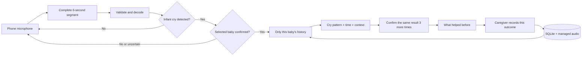

# SootheTrace

> A phone-first memory aid that recalls what helped during a baby's similar earlier crying
> episodes.

## Inspiration

Anyone who knows Prasanna knows how much he loves his nephew. His nephew is even the wallpaper on
his phone. Watching him grow toward his second birthday has brought the whole family a lot of joy,
but the road there has not always been easy.

There were endless nights of crying. Prasanna would see his sister exhausted after trying one
thing after another to settle the baby. Sometimes she was too tired even to answer a call. The
family slowly learned what might help, but those small lessons were easy to forget during the next
stressful night.

That experience inspired SootheTrace. At 3:00 AM, a caregiver may not need another generic list of
parenting tips. They may simply need help remembering what happened the last time this baby
sounded similar, at a similar time, and what actually helped.

## What it does

SootheTrace turns a phone into a hands-free listening companion. It records complete 6-second
segments, checks whether an infant cry is present, and checks whether the sound is consistent with
the selected baby's enrolled profile. Once the profile is confirmed, it searches only that
baby's earlier incidents.

It combines the cry pattern with the time of day and any available caregiver context. It can then
surface a simple suggestion from the family's own history:

> **What helped before: held baby upright.**

The suggestion fills the phone screen so it can be read from a distance. When the caregiver stops
the session, SootheTrace asks what they tried and whether it helped. That answer becomes part of
the baby's growing care memory.

- Continuous microphone capture from the phone in complete 6-second segments
- A local infant-cry gate that screens for infant-cry evidence before identity matching
- Acoustic matching against the selected infant profile, with abstention instead of forced naming
- Profile-isolated retrieval, so one baby's history is never mixed with another baby's history
- Ranking using cry-pattern similarity, time of day, and available caregiver context
- A large, latched suggestion designed to remain readable while the caregiver holds the baby
- Playback of the supporting prior incidents
- A follow-up form that records what the caregiver tried and whether it helped
- A simple laptop processing view for showing the live backend during a presentation
- Three included, verified demo recordings that produce three different history-grounded results

SootheTrace is a memory aid, not a cry translator. It does not diagnose hunger, pain, colic,
illness, or any medical cause.

## The hackathon demo

The demo bootstrap creates a controlled `Demo Baby` profile. The repository includes three
separate Baby X recordings, and each recording is used in a fresh session.

| Demo file | Expected result |
|---|---|
| [X4 playback](demo_assets/baby_audio/warning-demo/demo-baby-x4-extended-playback.wav) | `What helped before: offered bottle.` |
| [X7 playback](demo_assets/baby_audio/warning-demo/demo-baby-x7-extended-playback.wav) | `What helped before: held baby upright.` |
| [X8 playback](demo_assets/baby_audio/warning-demo/demo-baby-x8-extended-playback.wav) | `What helped before: turned on white noise.` |

The first grounded result is held privately. Three additional 6-second infant-cry segments must
confirm the same recommendation before it appears. If the recommendation changes, confirmation
restarts. The earliest ordinary reveal is therefore about 24 seconds after capture begins.

The six prior incidents installed for this demo are clearly marked synthetic. They demonstrate
the retrieval architecture without pretending to be clinical data or real family history.

## How we built it

We did not place one large AI call behind a microphone and ask it to guess why a baby was crying.
We built a custom multi-stage pipeline so that every claim has a clear source.

The phone interface uses the browser MediaRecorder and Web Audio APIs. Our JavaScript capture loop
creates complete 6-second files, retries the same bytes when an upload fails, and drives a
responsive interface for portrait and landscape use.

The laptop runs a custom Python server. FFmpeg converts each upload into 16 kHz mono audio. A local
AudioSet AST model acts as the infant-cry gate. Our calibrated MFCC87 pipeline handles the
fixed-rig infant profile check. NumPy and SciPy power the acoustic fingerprinting and comparison.

After identity is accepted, our own retrieval layer searches a profile-isolated SQLite history.
It ranks earlier incidents using cry-pattern similarity, time of day, and caregiver tags. Our
confirmation logic holds the first result until three more segments support the same action. We
also built the evidence playback, outcome capture, local data model, demo bootstrap, and live
backend monitor ourselves.



The phone is the caregiver interface. The Python server, acoustic models, SQLite database, and
managed audio remain on the laptop.

### What contributes to the result

Identity and care-memory ranking are separate decisions.

| Signal | Role |
|---|---|
| Infant-cry evidence | Prevents speech and unrelated environmental sound from entering the baby-matching path |
| Normalized cry audio | Checks acoustic consistency with the selected infant profile |
| Cry-pattern similarity | Finds acoustically similar incidents after identity is accepted |
| Time of day | Helps prioritize incidents that happened at a similar hour |
| Caregiver tags | Adds explicit context when tags are available |
| Earlier actions and outcomes | Supplies the only actions the app is allowed to suggest |

With all ranking inputs present, the current product weights are:

```text
65% cry-pattern similarity
20% time-of-day similarity
15% caregiver tag overlap
```

Missing inputs are omitted and the remaining weights are renormalized. Time and tags can rank
incidents, but they never decide whose cry was recorded. The current showcase starts with no live
tags, so its result uses cry-pattern similarity and server-local time. Tags entered after Stop are
stored as context for later incidents.

## Build and run

The demonstrated setup is macOS plus iPhone. The first installation needs internet access for
Python packages, the public baseline corpus, and acoustic-model downloads.

### Prerequisites

- macOS with Command Line Tools
- Homebrew
- Python 3.12
- FFmpeg
- Node.js, only for browser tests
- An iPhone and Mac on the same local network for phone capture

Install the required tools:

```bash
xcode-select -p
brew install uv ffmpeg node
```

If Command Line Tools are missing, run `xcode-select --install`, finish the installer, and repeat
the command above.

### 1. Clone and install

```bash
git clone https://github.com/Prasshanna-S/soothetrace.git
cd soothetrace

uv venv .venv --python 3.12
source .venv/bin/activate
uv pip install -r requirements.txt
```

Do not install `librosa`. The acoustic path deliberately uses NumPy and SciPy without its
Numba dependency chain.

### 2. Build the normalization baseline

The repository does not commit generated databases. Build the required population baseline from
the public Donate-a-Cry corpus:

```bash
git clone --depth 1 \
  https://github.com/gveres/donateacry-corpus.git \
  experiments/donateacry-corpus

.venv/bin/python tools/build_baseline.py
```

Wait for `population baseline saved`. Without this baseline, the system intentionally refuses to
compare raw acoustic vectors.

### 3. Prepare the working demo

```bash
.venv/bin/python scripts/prepare_care_demo.py
```

This idempotent command:

- creates `Demo Baby` and `Learning Baby`;
- enrolls three independent fixed-rig references for each profile;
- installs six clearly labeled synthetic Demo Baby memories;
- maps X4 to bottle, X7 to upright holding, and X8 to white noise;
- preserves real caregiver history; and
- avoids duplicating profiles, enrollments, or memories when run again.

### 4. Start the laptop demo

```bash
.venv/bin/python -m src.http_api \
  --http \
  --host 127.0.0.1 \
  --port 8000 \
  --data-root data/audio \
  --static-root web \
  --db data/episodes.db
```

The first start may download acoustic-model files. Open the health check and confirm that
`care.ready` and `care.cry_detector.ready` are both `true` before starting the demo.

Open:

- app: [http://127.0.0.1:8000](http://127.0.0.1:8000)
- live processing view: [http://127.0.0.1:8000/backend.html](http://127.0.0.1:8000/backend.html)
- health check: [http://127.0.0.1:8000/api/health](http://127.0.0.1:8000/api/health)

This localhost mode is the quickest way to confirm that a clean clone builds and runs.

## Use the live app on an iPhone

Mobile Safari requires trusted HTTPS before it will expose the microphone to a page on the local
network.

### 1. Find the Mac's local address

```bash
ifconfig en0 | awk '/inet / {print $2}'
```

Use the active non-loopback address, such as `10.21.6.4`. If `en0` is not the active interface,
find the current address in **System Settings > Network**.

### 2. Generate the local certificate

Replace `10.21.6.4` with the Mac's actual address:

```bash
.venv/bin/python spikes/mobile_capture/make_cert.py 10.21.6.4

.venv/bin/python spikes/mobile_capture/bootstrap.py \
  --host 0.0.0.0 \
  --port 8080 \
  --cert data/audio/mobile-capture-spike/certs/rootCA.pem
```

On the iPhone, open:

```text
http://10.21.6.4:8080/Interaction-Memory-Spike-CA-corrected.mobileconfig
```

Then:

1. Allow the profile to download.
2. Open **Settings > General > VPN & Device Management**.
3. Install **Interaction Memory Local Spike CA**.
4. Open **Settings > General > About > Certificate Trust Settings**.
5. Enable full trust for the certificate.
6. Stop the temporary bootstrap server with Control-C.

Never share `rootCA.key` or `server.key`.

### 3. Start the HTTPS app

```bash
.venv/bin/python -m src.http_api \
  --host 0.0.0.0 \
  --port 8443 \
  --data-root data/audio \
  --static-root web \
  --db data/episodes.db \
  --cert data/audio/mobile-capture-spike/certs/server.pem \
  --key data/audio/mobile-capture-spike/certs/server.key
```

Open:

```text
Phone app:        https://10.21.6.4:8443/
Laptop monitor:   https://10.21.6.4:8443/backend.html
Health check:     https://10.21.6.4:8443/api/health
```

Allow microphone access when prompted. For an app-like full-screen view, select **Share > Add to
Home Screen** in Safari and launch the app from the new icon.

## Reproduce the three-result showcase

1. Run `.venv/bin/python scripts/prepare_care_demo.py`.
2. Start the HTTP or HTTPS server.
3. Select `Demo Baby`.
4. Start a new listening session.
5. Play one included 45-second file from another device.
6. Keep the speaker, volume, distance, room, phone position, and microphone unchanged.
7. Watch infant detection and confirmation progress.
8. After the suggestion appears, press Stop.
9. Record what the caregiver tried and whether it helped, or discard the rehearsal.
10. Start a fresh session before playing the next file.

The 45-second files repeat their own 15-second source to provide presentation time. Those repeats
are not independent evidence.

Exact checksums, source roles, exclusions, and subtitle files are in the
[demo evidence guide](demo_assets/baby_audio/warning-demo/README.md).

## Measured prototype evidence

These are controlled proof-of-concept results, not population accuracy.

| Test | Result |
|---|---:|
| ESC-50 baby-cry benchmark subset | 40 of 40 accepted |
| Sampled ESC-50 environmental negatives | 245 of 245 rejected |
| Checked-in infant rehearsal fixtures | 14 of 18 accepted |
| Adult cry-imitation fixtures | 10 of 10 rejected by the infant gate |
| Two-infant fixed-rig identity trials | 13 of 15 resolved correctly, 0 wrong names |
| Three SootheTrace showcase recordings | 3 of 3 produced the expected distinct action after confirmation |

The fixed-rig results are channel-sensitive. Room, phone, codec, distance, gain, and background
sound can affect performance. The broader evidence and exact limitations are documented in
[Accuracy Status](docs/ACCURACY-STATUS.md).

## Run the tests

Core Python suite:

```bash
.venv/bin/python -m unittest discover -s tests -v
```

Focused care-demo suite:

```bash
.venv/bin/python -m unittest \
  tests.test_care_sessions \
  tests.test_live_session_http \
  tests.test_product_real_audio_api \
  tests.test_demo_diagnostics_http \
  tests.test_prepare_care_demo -v
```

Browser contract:

```bash
npm install --no-save --package-lock=false playwright
npx playwright install chromium
node tests/test_live_session_browser.mjs
node --check web/app.js
node --check web/backend.js
```

## Repository map

| Path | Responsibility |
|---|---|
| `web/` | Phone interface and laptop processing view |
| `src/http_api.py` | Local HTTP and HTTPS server |
| `src/audio_ingest.py` | Upload validation, FFmpeg decode, and normalization |
| `src/cry_gate.py` | Local infant-cry gate |
| `src/identity.py` | Profiles, enrollment, matching, retry, and abstention |
| `src/care_sessions.py` | Continuous segment processing and confirmed guidance latch |
| `src/retrieve.py` | Profile-scoped incident ranking |
| `src/guidance.py` | Selection of previously recorded helpful actions |
| `src/store.py` | SQLite persistence |
| `scripts/prepare_care_demo.py` | Repeatable two-profile demo setup |
| `demo_assets/` | Included infant and consented adult rehearsal audio |
| `docs/SYSTEM-FLOW.md` | Detailed data flow and storage boundaries |
| `docs/DEMO-READY.md` | Presentation runbook |

## Scope and safety

SootheTrace is a hackathon proof of concept. It is not:

- a medical device;
- an emergency alert or unattended safety monitor;
- a substitute for a caregiver or pediatrician;
- a classifier for hunger, pain, illness, or abuse;
- proof that an acoustic match identifies a baby in unconstrained conditions; or
- ready for production storage of family audio.

A production version would require verified and consented infant-identity data, testing across
devices and rooms, authentication, encryption, retention controls, security review, clinical
review, and caregiver-centered usability research.

## Why this direction matters

Most cry-analysis ideas ask a model to guess what a baby means. SootheTrace takes a more grounded
route: remember this family's own history, make the evidence visible, abstain when the signal is
weak, and let the caregiver record what happened next.

The long-term value is not one prediction. It is a personal care memory that becomes more useful
one honest incident at a time.
