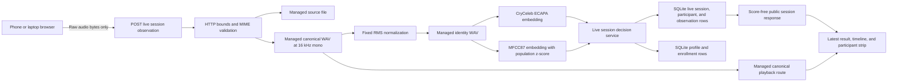
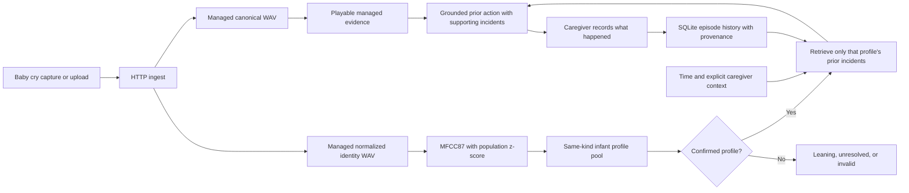
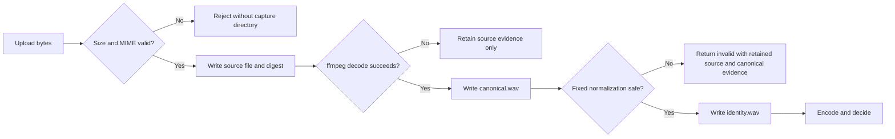

# Architecture

This document describes the running local product paths. Identity decisions are acoustic. Time,
notes, outcomes, scenario labels, and expected-person labels do not enter acoustic identity.

## System boundaries

- The browser captures microphone audio or reads a selected file.
- The laptop HTTP server validates, decodes, normalizes, encodes, decides, and persists.
- Accepted audio is retained as distinct source, canonical, and identity files.
- Human identity uses CryCeleb ECAPA plus MFCC87 pair evidence and the calibrated same-kind
  profile pool.
- Baby identity uses MFCC87 with a stored population baseline.
- The public boundary returns ordinal states, labels, reasons, and managed playback URLs. It
  removes acoustic scores, margins, candidates, quality metrics, embeddings, digests, expected
  labels, and filesystem paths.
- A new live session creates an independent session row. It does not delete prior profiles,
  enrollments, sessions, incidents, or baselines.

The acoustic identity path is local after the model checkpoint and population baseline are
available. Optional speech processing for incident notes is separate from identity and is not
required for the human live-session critical path.

## Human incremental identity



### Observation decision order

`src/http_api.py` first checks that the session exists and is open. It then runs
`src/audio_ingest.py`. Unsupported MIME, empty uploads, oversized uploads, or decode failures
return 422 before acoustic identity is called.

For ready identity audio, `src/live_sessions.py` uses this order:

1. Reject a missing, unusable, or completed-session input.
2. Store a repeated managed identity-audio digest as a `duplicate` observation without
   reinforcement.
3. Create provisional Person A from the first usable observation.
4. When Person A or another provisional participant has unique direct pair support, reinforce it
   before generic pool identification.
5. Otherwise identify only within the current session's same-kind profile IDs.
6. Reinforce a confirmed known result.
7. Keep a weak leader as `leaning` without enrollment.
8. Keep a safe outlier as pending acoustic evidence. One outlier cannot create a later participant.
9. If a new outlier agrees with exactly one pending observation, create the next stable label and
   enroll both recordings. That later participant begins established with support 2.
10. Return `possible_new` or `leaning` when the evidence is not safe to reinforce and not enough
    to create a participant.

Pending observations are stored in `live_identity_observation`. A pending item is treated as
consumed when its digest appears in an enrollment for a participant in that session. No expected
identity is stored or sent to the decision service.

### Stable session labels

Labels are generated with spreadsheet-style letters:

```text
1  -> Person A
26 -> Person Z
27 -> Person AA
```

The participant row owns the stable label, state, and support count. The underlying profile row
owns acoustic enrollments.

## Baby identity and personal care memory



The identity attempt lifecycle may use one independent retry. A retry is a second acoustic
observation, not an averaged waveform or a repeated roll presented as proof. Only a confirmed
profile can enter incident retrieval.

Within that confirmed profile, retrieval ranks prior incidents using:

| Signal | Weight |
|---|---:|
| Cry similarity inside the confirmed profile | 0.65 |
| Cyclic time-of-day similarity | 0.20 |
| Explicit caregiver notes and tags | 0.15 |

Missing signals are omitted and remaining weights are renormalized. These weights rank personal
history. They do not classify a medical cause.

Guidance selects a caregiver-recorded prior action only from settled supporting incidents. The
public result includes the supporting incident IDs and managed playback URLs. Completion writes
the current incident once with provenance.

## Browser and laptop responsibilities

| Browser | Laptop server |
|---|---|
| Microphone capture | Bounded upload and MIME validation |
| Audio file selection | ffmpeg decode to canonical WAV |
| New session, record, stop, select, and submit controls | Fixed RMS normalization |
| Latest result, timeline, playback, participant strip | MFCC87 and CryCeleb encoding |
| Same-origin HTTP calls | Session decisions and SQLite writes |
| No expected-person label | Baby retrieval, guidance, and outcome storage |

At 900 pixels and above, the human work screen uses explicit capture and result columns. Timeline
and participant strip span the workspace. Below 900 pixels it uses one column. Phone controls
retain 44 pixel targets and safe-area padding.

## Source module map

| Module | Responsibility |
|---|---|
| `web/index.html` | Baby and human surfaces with live-session landmarks |
| `web/app.js` | Browser capture, automatic human submission, public result rendering, playback |
| `web/app.css` | Wide desktop grid, phone collapse, dotted and solid participant states |
| `src/http_api.py` | HTTP routing, ingest handoff, public allowlists, canonical playback |
| `src/audio_ingest.py` | Upload bounds, MIME validation, managed files, decode, fixed normalization |
| `src/encoders.py` | MFCC87 and CryCeleb ECAPA adapters |
| `src/identity.py` | Profiles, enrollment, calibrated identity, scoped pools, pair consistency |
| `src/live_sessions.py` | Session lifecycle, pending evidence, labels, decisions, reinforcement |
| `src/retrieve.py` | Profile-isolated incident ranking |
| `src/guidance.py` | Caregiver-history-grounded action selection |
| `src/careflow.py` | Confirmed identity to preview and one-time completion |
| `src/store.py` | Episode, baseline, and supporting SQLite persistence |

## HTTP routes

### Live sessions

| Method and route | Success | Other expected results |
|---|---:|---|
| `POST /api/live-sessions` | 201 | 400 for invalid kind or request |
| `GET /api/live-sessions/{session_id}` | 200 | 404 for missing session |
| `POST /api/live-sessions/{session_id}/observations` | 201 | 422 invalid, 409 completed, 404 missing |
| `POST /api/live-sessions/{session_id}/complete` | 200 | 404 for missing session |
| `GET /api/audio/live-observations/{observation_id}` | 200 `audio/wav` | 404 missing, noncanonical, or outside managed root |

The duplicate result is an accepted observation and returns 201. Playback resolves only a managed
file named `canonical.wav`.

### Baby identity and care memory

| Method and route | Purpose |
|---|---|
| `GET /api/profiles` | List public profile summaries |
| `POST /api/profiles` | Create a baby or human profile |
| `POST /api/profiles/{id}/enroll` | Ingest and enroll one independent reference |
| `POST /api/identity/attempts` | Create an identity attempt |
| `POST /api/identity/attempts/{id}/captures` | Submit the first attempt capture |
| `POST /api/identity/attempts/{id}/retry` | Submit the one allowed independent retry |
| `POST /api/incidents/{attempt_id}/preview` | Read grounded profile history without writing |
| `POST /api/incidents/{attempt_id}/complete` | Save the current outcome once |
| `GET /api/audio/enrollments/{id}` | Play managed enrollment evidence |
| `GET /api/audio/episodes/{id}` | Play managed incident evidence |

## Managed audio and failure boundaries



| Stage | Retained data | Purpose |
|---|---|---|
| Upload accepted | `source.<ext>` | Exact received evidence |
| Decode succeeds | `canonical.wav` | Stable 16 kHz mono processing and playback |
| Normalization succeeds | `identity.wav` and its SHA-256 | Acoustic identity input and live-session duplicate key |
| Encoder runs | Embedding in enrollment or query state | Profile comparison and private audit |
| Observation accepted | Status, reasons, associations, managed paths, digest | Session timeline and audit |
| Public response | Labels, states, reasons, playback URLs | UI without private metrics or storage details |

Invalid decode may retain `source.<ext>` without canonical or identity audio. Unsupported MIME,
empty payloads, and oversized payloads are rejected before creating a capture directory.

## SQLite data map

| Table | Key retained state |
|---|---|
| `episode` | Subject, time, duration, audio, fingerprint, transcript, intervention, outcome, provenance, context |
| `baseline` | Population or subject sample count, mean vector, standard-deviation vector |
| `profile` | Display name, kind, readiness state, creation time |
| `enrollment` | Profile reference path, digest, capture facts, encoder version, embedding |
| `identity_query` | Private audit result, matched profile, score, margin, reasons, versions |
| `identity_attempt` | Attempt kind, status, retry state, nomination, resolution |
| `identity_attempt_capture` | Source, canonical, identity paths, digest, quality, candidates, private scores |
| `live_identity_session` | Kind, open or completed state, timestamps |
| `live_identity_participant` | Session profile, stable label, provisional or established state, support count |
| `live_identity_observation` | Sequence, managed paths, digest, status, associations, reinforcement, reasons |

The schema is additive. Human and infant profiles are separated by `kind`. A session-scoped
comparison receives only the profile IDs in that live session, while the older identity-attempt
path scores the full same-kind pool.

## Public and private data

| Boundary | Private retained data | Public result |
|---|---|---|
| Ingest and observation | Managed paths, identity-audio digest, quality | Invalid reason or later ordinal result |
| Acoustic comparison | Embeddings, score, margin, candidate order, calibration versions | Status, stable participant, reason codes |
| Live session | Profile association, pending evidence, observation associations | Participant state, support count, timeline, playback URL |
| Care memory | Profile-scoped incidents, context, action, outcome, provenance | Grounded recommendation and supporting incident references |

The public renderers use explicit field and scalar-type allowlists. Playback URLs are reconstructed
from validated integer IDs rather than copied from service data.

## Evidence status

The real live-session evaluator runs every recording through the actual local HTTP and ingest path.
Its staged and difficult fixed orders each represented 3 of 3 expected adult sources with 3
participants, 0 wrong named directions, 0 duplicate profiles, and 0 known-person splits. Direction
was shown on 7 of 9 comparison-eligible observations in each order. The exact public responses and
latencies are stored in
[`../demo_assets/human_audio/live-session-results.json`](../demo_assets/human_audio/live-session-results.json).

This is demonstration evidence from ten correlated recordings and three consenting adult
imitators. It is not population accuracy, does not establish infant performance, and does not
support a diagnostic or causal claim.

## Next technical work

1. Collect verified infant identity data with explicit consent.
2. Measure more phones, rooms, distances, microphones, speakers, and replay paths.
3. Evaluate more participants and longer sessions.
4. Calibrate session clustering and implement an explicit pending-pattern merge.
5. Keep time, notes, prior incidents, and context confined to care retrieval.
6. Add authentication, encryption, deletion, consent records, and retention controls before real
   deployment.
