# SootheTrace presentation brief

## One-sentence idea

SootheTrace turns a family's own recorded care history into a gentle reminder
of what helped during a similar earlier crying episode.

## Inspiration

Everyone who knows Prasshanna knows how much he loves his nephew. His nephew is
his phone wallpaper, and he is now close to two years old. The road to that
point was not always easy. There were endless nights of crying, and Prasshanna's
sister often looked too exhausted to even take a call.

That experience inspired a simple question: what if a caregiver did not have to
remember every previous night while carrying a crying baby? What if the phone
could quietly keep a family-specific memory of what happened, what was tried,
and what helped?

SootheTrace is our proof of concept for that memory loop. It does not claim to
translate a baby's cry. It checks whether a sound is infant-cry-like, checks the
selected baby's acoustic profile, and then looks only at that baby's prior
recorded situations. If the history is strong enough, it can surface a reminder
such as “What helped before: offered bottle.”

## What the prototype does

1. The caregiver chooses a baby profile and starts listening.
2. The browser records complete 3-second audio segments.
3. The server checks whether each segment contains infant-cry-like audio.
4. Accepted segments are compared with the selected baby profile.
5. Only a selected-profile match can open that baby's memory.
6. Similar prior incidents are ranked using cry pattern, time of day, and
   caregiver tags when available.
7. A recommendation must be a real action stored in supporting prior incidents.
8. The caregiver can dismiss or reopen the suggestion while recording
   continues.
9. Stop asks what the caregiver actually did, whether it helped, and what is
   worth remembering.
10. Save adds that incident to the baby's History for future sessions.

## Why the idea is different

The product is not a generic list of baby-care advice and it is not a one-shot
cry classifier. Its core unit is a private, evolving memory for one baby.

The same cry pattern can mean different things in different family contexts.
SootheTrace combines:

- the current cry pattern;
- the selected baby's acoustic profile;
- time of day;
- caregiver-entered context tags;
- caregiver speech or notes when available;
- actions tried before;
- caregiver-reported outcomes; and
- prior audio evidence.

Identity and context remain separate. Time, notes, and outcomes never decide
whose cry it is. They are used only after the selected profile passes the
acoustic check.

## Technical architecture

```mermaid
flowchart LR
    A["Phone browser<br/>3-second complete segments"] --> B["Python same-origin API"]
    B --> C["FFmpeg<br/>16 kHz mono PCM WAV"]
    C --> D{"AudioSet AST<br/>infant-cry gate"}
    D -->|"No or uncertain"| E["Keep listening<br/>no suggestion"]
    D -->|"Cry evidence"| F["Custom MFCC87<br/>profile representation"]
    F --> G["421-recording population<br/>z-score normalization"]
    G --> H{"Selected baby<br/>accepted?"}
    H -->|"No or uncertain"| E
    H -->|"Yes"| I["Selected profile's<br/>SQLite incidents only"]
    I --> J["65% cry pattern"]
    K["20% time of day"] --> N["Fixed context ranker"]
    L["15% caregiver tags"] --> N
    J --> N
    N --> O["Stored action and<br/>caregiver outcome"]
    O --> P["20-second, 7-segment<br/>Demo Baby confirmation"]
    P --> Q["Grounded suggestion"]
    Q --> R["Caregiver follow-up"]
    R --> S["Managed audio plus<br/>new memory"]
    S --> I

    C --> T["Human Baby branch"]
    T --> U["CryCeleb ECAPA"]
    U --> V["Session-scoped<br/>participant patterns"]
```

## What is custom

### MFCC87 infant representation

The infant profile path uses a project-specific 87-dimensional acoustic
representation:

- 20 MFCC means;
- 20 MFCC standard deviations;
- 20 delta-MFCC means;
- 20 delta-MFCC standard deviations;
- pitch mean, standard deviation, 10th percentile, and 90th percentile;
- spectral-centroid mean and standard deviation; and
- voiced-frame fraction.

The server averages usable 1.5-second windows, z-scores the vector against a
stored 421-recording population baseline, and then compares normalized
representations. A raw cosine value is not shown as confidence.

### Cry presence gate

The server uses the public AudioSet AST checkpoint
`MIT/ast-finetuned-audioset-10-10-0.4593`, then applies project-specific
thresholds and a dominance rule over baby-cry and generic crying labels. The
gate can accept, abstain, or fail closed.

### Memory and context ranker

After a selected-profile match, prior incidents use fixed product weights:

| Signal | Base weight | Purpose |
|---|---:|---|
| Cry-pattern similarity | 65% | Find acoustically similar prior situations |
| Time of day | 20% | Favor a similar local care window |
| Caregiver tags | 15% | Use explicit context overlap when provided |

Missing signals are omitted and the remaining weights are renormalized. The
weights are product heuristics, not learned clinical probabilities.

### Grounding and latch

The displayed action must come from a stored supporting incident. Demo Baby
then waits for:

- at least 20 seconds of processed audio;
- at least seven processed segments; and
- six distinct segments supporting the same action.

Exact and near-duplicate source audio does not add independent confirmation.
The first grounded decision is latched for the session.

## Three presentation profiles

| Profile | What it demonstrates |
|---|---|
| Demo Baby | Preloaded controlled memories and three distinct live suggestions |
| Learning Baby | A real cold start that can match its own enrolled audio and store caregiver follow-ups without inventing advice |
| Human Baby | A playful adult cry-imitation activity that forms provisional and established session patterns |

Human Baby is a separate experiment. It is not infant evidence and is not a
biometric identity claim.

## Recommended demo story

### Part 1: honest cold start

1. Open Learning Baby.
2. Start listening and play the matching Learning Baby source.
3. Show infant-cry detection and selected-profile comparison.
4. Explain that there is no care suggestion because this baby has no grounded
   care history yet.
5. Stop and enter what was tried and whether it helped.
6. Save and open History to show the new incident.

The point is restraint. The system stores evidence instead of guessing.

### Part 2: memory returning at the right moment

1. Select Demo Baby.
2. Keep the processing monitor visible on the laptop.
3. Start listening on the phone.
4. Play one controlled long-form source from the laptop.
5. Show cry detection before the suggestion.
6. Show profile comparison and confirmation progress in the monitor.
7. Let the phone surface the grounded suggestion.
8. Swipe through why it appeared and the supporting previous situations.
9. Stop, add the caregiver follow-up, and save it to History.

Controlled sources:

| Source | Expected grounded suggestion | Verified latch |
|---|---|---:|
| X4 | offered bottle | 21 seconds |
| X7 | held baby upright | 30 seconds |
| X8 | turned on white noise | 21 seconds |

### Part 3: playful audience interaction

1. Open Human Baby.
2. Ask two or three people to imitate a cry, one clip at a time.
3. Let the empty session create provisional participant patterns.
4. Repeat clips to show a pattern becoming established or leaning toward a
   participant.

Describe this as a direction of travel, not verified identity.

## Latest live evidence

On July 30, 2026, the physical iPhone and laptop path produced a successful
Demo Baby result:

- profile: Demo Baby;
- 37 total received segments before Stop;
- the decision latched during the live session;
- recommendation: “What helped before: offered bottle.”;
- supporting incidents: 2;
- basis: cry pattern plus similar time of day;
- caregiver follow-up saved as incident 7;
- saved action: “Held and cuddled”;
- saved outcome: “The baby did not settle.”; and
- the History API returned the new incident first.

The same test first failed to open memory while Learning Baby was selected.
That was correct behavior because Demo Baby audio must not open another
profile's memory.

## Engineering evidence

These are controlled engineering checks, not population accuracy:

| Check | Result |
|---|---:|
| Completed full Python regression | 443 passed, 9 intentional skips |
| Post-review retrieval and care regression | 128 passed |
| Contaminated-history long-form replay | X4, X7, and X8 all passed with distinct outputs |
| Checked-in infant rehearsal fixtures | 14 of 18 accepted |
| Adult cry imitations at infant gate | 10 of 10 rejected |
| Two-profile fixed-rig infant trial | 13 of 15 correct, 0 wrong names, 2 abstentions or retries |
| Human Baby staged directions | 7 of 7 shown directions correct in a 10-recording, 3-person consenting cohort |

Do not call these population sensitivity, specificity, or clinical accuracy.
Room acoustics, microphone, speaker, volume, distance, gain, and codec affect
the result.

## Suggested slide structure

1. **The night that inspired it**
   - Prasshanna, his nephew, and an exhausted new parent.
2. **The problem**
   - Caregivers cannot search their own memory while holding a crying baby.
3. **The idea**
   - A family-specific care memory, not a cry translator.
4. **The live loop**
   - Listen, gate, match, remember, suggest, record outcome.
5. **How we built it**
   - AST, custom MFCC87, population normalization, profile-only retrieval,
     context ranking, SQLite, and browser capture.
6. **What the phone shows**
   - Large suggestion, why it appeared, prior situations, and History.
7. **What worked**
   - Three distinct controlled outputs and the physical phone bottle test.
8. **What remains honest**
   - Small controlled evidence, abstention, channel sensitivity, and no medical
     claim.
9. **Where it can go**
   - Personal onboarding, more real family outcomes, stronger acoustic models,
     privacy review, and a native shell later.

## Safe presentation language

Use:

- “This resembles earlier recordings from the selected baby.”
- “This action helped in two similar recorded situations.”
- “Time of day helped rank the selected baby's own history.”
- “The system can abstain when the selected profile is not supported.”
- “This is a proof of concept with controlled evidence.”

Avoid:

- “The baby is hungry.”
- “We know why the baby is crying.”
- “The model is 95% confident.”
- “This verifies the baby's identity.”
- “This advice will calm the baby.”

## Visual assets and working surfaces

- Phone UI: `web/index.html`, `web/app.css`, `web/app.js`
- Presenter monitor: `web/backend.html`, `web/backend.css`, `web/backend.js`
- Action artwork: `web/img/`
- Controlled baby sources: `demo_assets/baby_audio/warning-demo/`
- Captions: `demo_assets/baby_audio/warning-demo/captions/`
- Technical details: `docs/TECHNICAL-ARCHITECTURE.md`
- Evaluation details: `docs/EVALUATION.md`

## Presentation build request

Use this brief as the factual source for the deck. The deck should feel warm,
personal, and technically credible. The personal story should open the
presentation, but the live functional loop should carry the middle. Use the
technical architecture diagram and controlled result table without turning the
prototype into a medical or accuracy claim.
