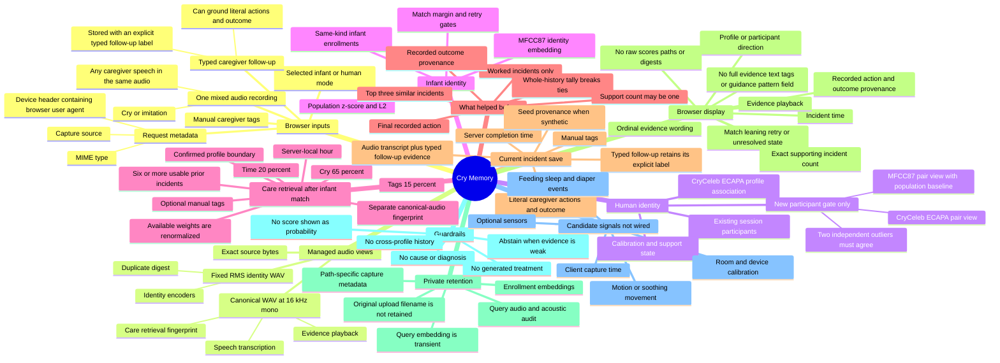
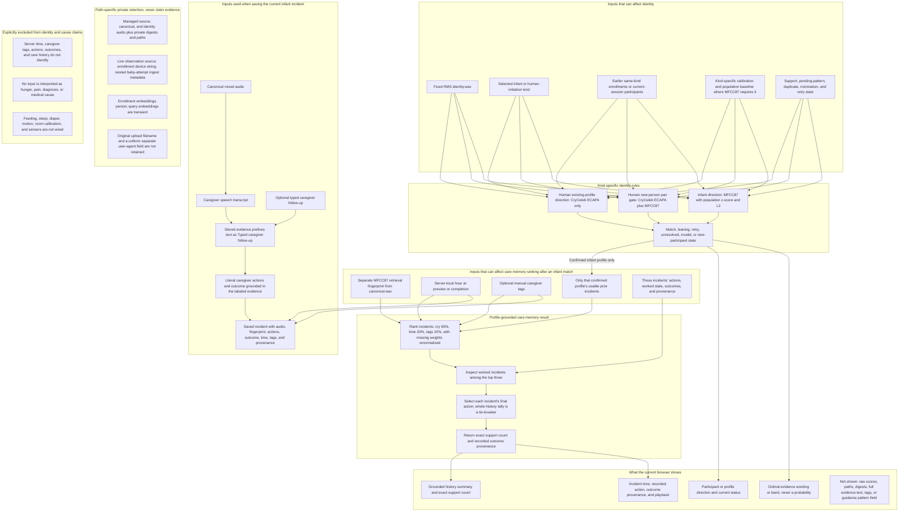
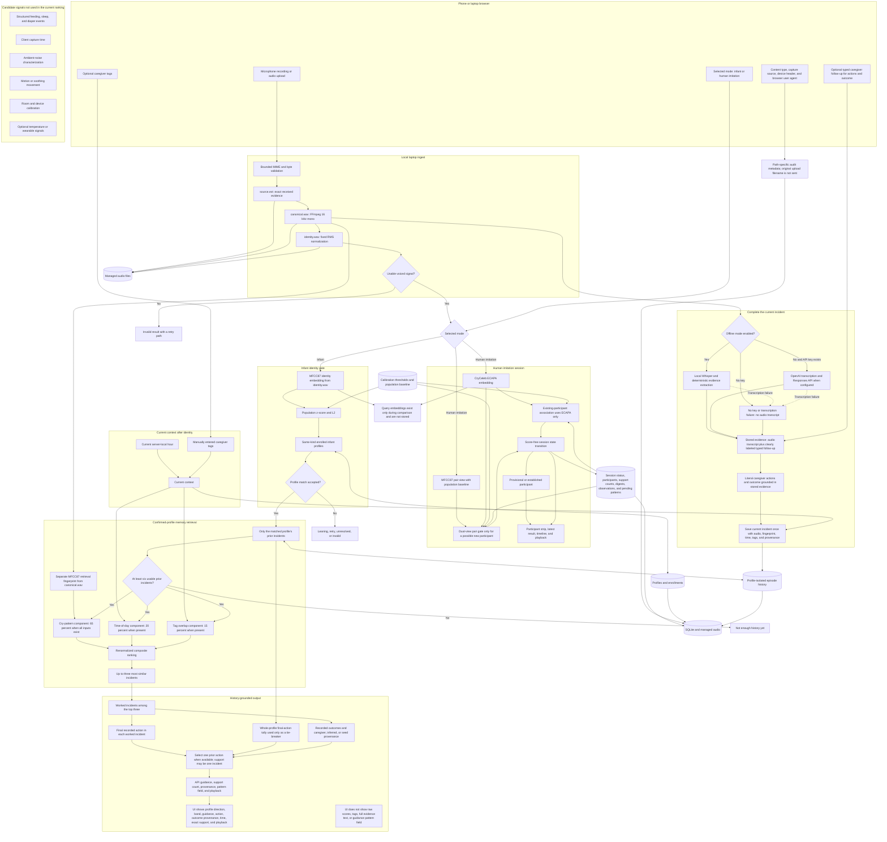

# Cry Memory System Map and Data Flow

This document separates three claims that must not be mixed:

1. Who does this recording acoustically resemble?
2. Which prior incidents belong to that confirmed profile?
3. What previously recorded action appears in the most similar worked incidents?

One mixed recording creates two acoustic views. Identity uses the fixed-level `identity.wav`.
Care-memory retrieval separately computes an MFCC87 fingerprint from `canonical.wav`, and only
after infant identity is confirmed. Server-local time and manual caregiver tags can rank that
profile's own memories. They do not identify the profile. Caregiver actions, outcomes, history, and
capture metadata also do not decide identity.

The current proof of concept does not infer a medical cause from a cry. Structured feeding, sleep,
and diaper events are planned but are not wired into the current database or API.

## Mind map

## What builds each claim and what appears on screen

Time is part of the care-memory claim, not the identity claim. The current implementation uses the
laptop server's local hour because the browser does not yet send a trusted client capture time.
Caregiver tags are optional manual inputs. A missing tag is treated as missing information, not as
negative evidence.

The interface can therefore say "this resembles Baby 2" and show that a similar recorded Baby 2
incident ended after rocking, with the exact number of displayed supporting incidents. It does not
show that tags caused the rank, and it cannot honestly say "this pattern means hunger," "rocking is
a treatment," or "time proves identity."

## End-to-end data flow

When one of the three ranking components is absent, the available weights are renormalized. Missing
tags do not count as negative evidence. The browser sends capture source plus an
`X-Capture-Device` value containing its user agent. Live observations retain capture source,
accepted enrollments retain that device string, and baby attempts retain nested ingest metadata.
The original upload filename is not sent, and the standard user-agent field is not retained
uniformly. None of this metadata increases an identity or care-memory score.

The incident API can return a guidance `pattern` field and stored evidence text. That evidence
prefixes typed text with `Typed caregiver follow-up:` rather than presenting it as transcribed
speech. The browser does not render either field. Query embeddings are used in memory during
comparison and then discarded.

## What contributes to each public result

| Public result | Inputs used now | Shown now | Inputs explicitly excluded |
|---|---|---|---|
| Human participant direction | Identity audio; CryCeleb ECAPA existing-profile view; prior session recordings; calibration; support and pending state. MFCC87 joins ECAPA only for the possible-new pair gate. | Participant label, status, ordinal evidence wording, exact support, timeline, playback | Time, tags, care history, actions, outcomes, expected-person labels |
| Infant identity | Identity audio; MFCC87; same-kind infant enrollments; population normalization; calibrated match, margin, and retry gates | Profile direction, evidence band, retry, unresolved, or invalid state | Time, tags, outcomes, interventions, care events |
| Similar prior incident ranking | Confirmed profile; separate canonical-audio fingerprint; server-local hour; manually entered tags; only that profile's history | Grounded summary and incident cards, without raw component scores or tags | Other profiles, the current follow-up entered after preview, capture metadata, structured care events |
| What helped before | Worked incidents among the top three; each incident's final recorded action; whole-history tally as a tie-breaker; recorded outcome provenance | Prior action, outcome provenance, exact supporting incident count, incident time, playback | New treatment generation, diagnosis, unsupported action, minimum support greater than one |
| Current incident record | Canonical audio; server completion timestamp; caregiver speech transcript; optional typed caregiver follow-up; literal interventions and outcome grounded in clearly labeled stored evidence; manual tags | Completion status and the saved incident card. Full evidence text and tags are not rendered. | Inferred medical cause, client capture time |

## Current data contract at a glance

| Data point | Collected now | Used for identity | Used for care-memory output | Shown in the current browser |
|---|---:|---:|---:|---:|
| Current mixed audio | Yes | Yes, through identity.wav | Yes, through a separate canonical-audio fingerprint after identity | Human observation playback, and infant playback after the incident is saved |
| Selected infant or human-imitation kind | Yes | Yes | Selects the workflow | Reflected by the active mode |
| Earlier same-kind recordings | Yes | Yes | Profile boundary only | Participant strip or profile direction |
| Calibration and population baseline | Yes | Yes | No | Readiness only, not raw values |
| Server-local time | Yes | No | Yes, 20% when all ranking inputs exist | Incident time |
| Manual caregiver tags | Optional | No | Yes, 15% when all ranking inputs exist | Input control only; not repeated in the result |
| Cry-pattern similarity | Yes | Yes, through the kind-specific identity view | Yes, through the separate retrieval fingerprint at 65% when all inputs exist | Evidence wording or band, not a raw score |
| Prior interventions | Yes, from audio transcript, clearly labeled typed follow-up, or seed data | No | Yes | Selected prior action |
| Prior caregiver outcomes | Optional | No | Yes | Recorded outcome and provenance |
| Supporting incident count | Derived | Human session structure only | Yes; it may be one | Yes, exactly |
| Caregiver speech in the audio | Optional | It remains in the unseparated identity input | Can ground literal actions and fallback outcome evidence | Full transcript is not shown |
| Typed caregiver follow-up | Optional | No | Can ground literal actions and the caregiver-sourced outcome; it is clearly labeled in stored evidence | Its resulting actions and outcome can appear on the saved incident, but the full evidence text is not shown |
| Query embedding | Transient | Yes | No | No, and it is not stored |
| Capture source and browser user agent | Sent, with path-specific retention | No | No | No |
| Synthetic demo memory | Optional seed script | No | Yes, when deliberately seeded | Seed provenance distinguishes it from a caregiver report |
| Feeding, sleep, diaper, motion, room, or sensor data | No | No | No | No |

## Storage boundaries

| Store | Data | Purpose |
|---|---|---|
| Managed audio directory | Exact upload bytes under a managed name, canonical WAV, normalized identity WAV | Reproducible processing and evidence playback |
| SQLite | Profiles, persisted enrollment embeddings, identity audit without query embeddings, live sessions, observations, incidents, context, outcomes, provenance, baseline | Local state and profile isolation |
| Local model directory | CryCeleb checkpoint copies | Offline reuse after the first download |
| Browser memory | Current controls, selected or recorded clip, and rendered public response | Transient interaction state, not the source of truth |
| OpenAI API, when offline mode is disabled and a key exists | Canonical audio for transcription, then transcript text for evidence extraction | Optional hosted speech path |

The server response uses an allowlist. It does not return local filesystem paths, acoustic
embeddings, similarity scores, margins, or private digests to the browser.
