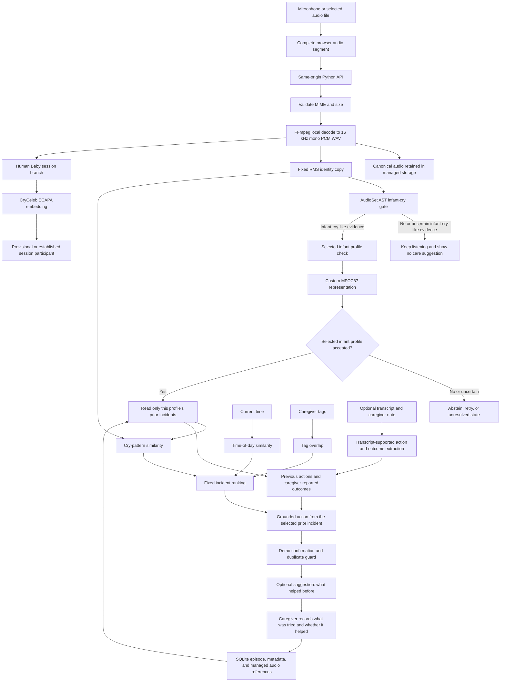

# Technical architecture

## Scope

SootheTrace is a browser and Python prototype that can run locally or behind one
hosted HTTPS origin. The included hosted path gives each consenting anonymous
visitor an isolated copy of the demo database and audio directory. Visitor data
expires after one hour and can be deleted immediately.

That prototype isolation is not production authentication, authorization,
encryption at rest, or a complete privacy and security program.

## Data flow

The diagram separates identity from retrieval intentionally. Current time, tags, transcripts, notes, previous actions, and outcomes never decide whose audio was recorded. They are eligible only after the selected profile passes the acoustic gate.

## Audio ingest and storage

`src/audio_ingest.py` accepts bounded supported audio uploads, retains source bytes, and uses local FFmpeg to create a 16 kHz mono PCM WAV. It creates a separate fixed-RMS identity WAV. No source separation, pitch processing, compression, or limiting is applied in the identity copy.

The prototype stores audio under the configured data root and persists application state in SQLite. Source paths, canonical paths, embeddings, digests, and private scoring information are implementation data. Public responses are allowlisted to avoid returning those internal details. This is not encrypted or authenticated storage.

## Infant-cry presence gate

The gate loads `MIT/ast-finetuned-audioset-10-10-0.4593` through Transformers. It reads two AudioSet labels, `Baby cry, infant cry` and `Crying, sobbing`, and applies project-specific thresholds plus a dominance rule.

This makes it a cry-presence filter, not an infant identifier. It reports infant-cry-like evidence for the current segment. It does not prove a biological infant, identify a particular infant, or determine why someone is crying. Gate failure is designed to block the downstream care flow.

## Acoustic profile paths

### Custom MFCC87 infant representation

The infant path uses `mfcc87-v1`, a project-specific deterministic feature representation rather than a trained neural model. It summarizes:

- 20 MFCC means and 20 MFCC standard deviations
- 20 delta-MFCC means and 20 delta-MFCC standard deviations
- pitch mean, standard deviation, 10th percentile, and 90th percentile
- spectral-centroid mean and standard deviation
- voiced-frame fraction

The implementation uses 1.5 second windows with a 0.75 second hop and averages usable window vectors. It then z-scores every vector against a stored population baseline and L2-normalizes it before cosine comparison. Raw MFCC87 cosine values are not valid comparison scores and must not be shown as confidence.

MFCC87 is the configured infant-demo representation. It is channel-sensitive and has only controlled fixed-rig evidence in this project.

### Optional CryCeleb ECAPA path

The registry can load the `Ubenwa/ecapa-voxceleb-ft2-cryceleb` ECAPA checkpoint through SpeechBrain. Its embeddings are L2-normalized directly and are not z-scored with the MFCC87 population baseline.

Current source uses this path for the separate `human_imitation` mode, where adults imitate cries. It is an optional model download, not a bundled model weight and not the shipped infant-demo default. The small adult-imitation result does not establish infant performance. Review the checkpoint card and applicable model and dataset terms before any hosted or commercial use.

## Profile decision and abstention

The server compares an input only with same-kind enrolled profiles. It can return a match, a weak or uncertain direction, a retry state, an unresolved state, or invalid input. A successful acoustic match is not a proof of identity. The current interface uses ordinal bands rather than presenting cosine similarity as a percentage confidence.

## Retrieval and suggestion

Once an infant profile is accepted, `src/retrieve.py` reads only that profile's past incidents. It scores candidates with a fixed heuristic:

| Available signal | Base weight | Meaning |
|---|---:|---|
| Cry-pattern similarity | 65% | Acoustic similarity to a prior incident |
| Time of day | 20% | Cyclic similarity of local hour |
| Caregiver tags | 15% | Jaccard overlap of supplied tags |

When a signal is unavailable, it is omitted and the other available weights are renormalized. These values are product choices, not a learned clinical model, probability, or causal explanation. The output should be read as: "this recorded action helped in a prior, acoustically and contextually similar incident," not "this is the action that will help now."

For the controlled profile named Demo Baby, a live suggestion also has to pass a
multi-segment confirmation rule. The server waits for at least 20 seconds, at
least seven processed segments, and six distinct segments supporting the same
grounded recommendation. Exact and near-duplicate source audio does not add
confirmation. This presentation rule does not apply to an ordinary infant
profile.

The first grounded decision is latched for that recording session. The caregiver
can dismiss the suggestion and return to listening, then reopen it without
stopping capture.

## Optional transcription and reasoning extraction

Speech processing is separate from the acoustic path. In default online mode, the configured transcription API model is `gpt-4o-transcribe`. With `IM_OFFLINE=1`, the code calls an externally installed Whisper CLI. The local Whisper dependency is optional and is not provisioned by `requirements.txt`.

An optional reasoning-model call can extract caregiver actions and outcomes from a transcript. It is instructed to return literal transcript evidence, and the implementation rejects unsupported evidence before storing it. A local regex extractor is available as a fallback. No generative model is used for infant-cry detection, acoustic identity, or causal interpretation.

## Hosted prototype

`Dockerfile`, `render.yaml`, and `scripts/hosted_entrypoint.py` define the
current hosted path. The hosting platform terminates HTTPS and preserves one
5 GB volume at `/var/data`. Fresh-disk startup installs the packaged non-audio
MFCC87 population baseline, prepares the controlled profiles, warms the
required models, and serves the API only after those steps succeed.

The HTTP layer issues an anonymous HttpOnly visitor cookie after explicit
consent. Each visitor receives a cloned demo database and separate managed audio
root. The session expires after one hour and has an immediate delete endpoint.
The blueprint intentionally runs one service instance because SQLite state and
the inference lock are process-local.

No public hosted URL is claimed. Before this design handles real family audio,
it still needs production authentication and authorization, reviewed encryption
at rest, robust deletion and retention operations, backup policy, monitoring,
model supply-chain review, and privacy and security review.
