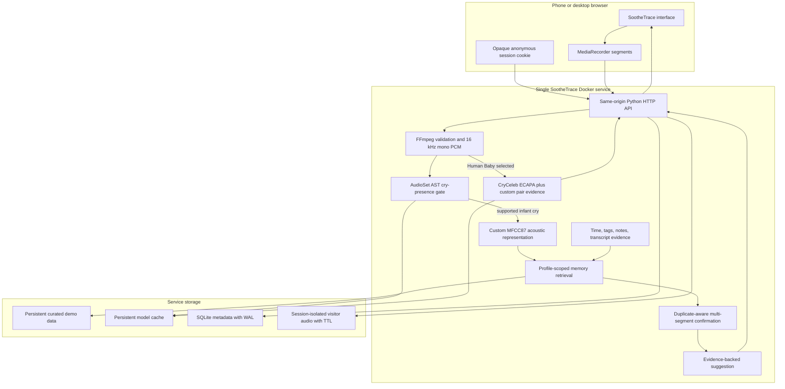

# Hosted SootheTrace Release Design

Date: 2026-07-30

Status: Approved

## Goal

Ship one public HTTPS link that opens directly in a phone browser and runs the
SootheTrace proof of concept without requiring a local certificate, a mobile
configuration profile, or a laptop-hosted server.

The release must preserve the strongest working product path:

1. Listen for short audio segments.
2. reject segments that do not contain a supported cry-like event;
3. compare accepted infant segments with memories scoped to the selected baby;
4. combine acoustic evidence with time, caregiver context, and previous outcomes;
5. wait for repeated support before displaying a suggestion;
6. show the earlier incidents that support the suggestion; and
7. let the caregiver confirm what happened.

The release also adds a deliberately small third profile called **Human Baby**.
It reuses the existing human cry-imitation matcher as an entertaining
demonstration of within-session participant grouping. It does not share the
infant guidance or identity path.

## Product boundaries

SootheTrace is a research proof of concept and a caregiver memory aid. It does
not diagnose why an infant is crying, guarantee identity, replace supervision,
or provide medical advice.

The interface must call outputs suggestions, supporting memories, or directions.
Similarity values are not probabilities. The application must not claim a
population-level accuracy result from the small curated demonstration set.

## User experience

### Profile selector

The existing profile selector contains three choices:

1. **Demo Baby**
   - Uses a curated persistent set of memories.
   - Supports a predictable presentation using documented demo recordings.
   - Displays the full Listen, History, and Baby experience.
2. **Regular Baby**
   - Starts with little or no history.
   - Builds memories from the current anonymous visitor session.
   - Displays the full Listen, History, and Baby experience.
3. **Human Baby**
   - Uses the same visual language and recording orb.
   - Treats each submitted recording as one observation.
   - Shows Person A, Person B, Person C, or a provisional new participant.
   - Shows a compact participant strip and observation timeline.
   - Does not run the infant-only cry gate, caregiver guidance, or latch.

Selecting Human Baby changes only the central Listen workspace. It does not add
a separate product or a large match laboratory. History and Baby remain infant
features and are hidden or unavailable while Human Baby is selected.

### Listen

The infant Listen screen records a series of approximately six-second browser
segments. Each segment has one current visual state. Status labels replace one
another and never stack.

The visible state sequence is:

1. Listening
2. Checking this segment
3. No supported cry found, still listening
4. Cry-like sound found
5. Comparing with this baby's memories
6. Building evidence, with a visible progress count
7. Suggestion ready

A server-confirmed suggestion is displayed without an artificial client delay.
The user can pause, stop, replay supporting memories, and save or discard the
session outcome.

### History

History is profile scoped and shows:

- start time and duration;
- playable recording where retention permits;
- cry-detection summary;
- caregiver speech excerpts;
- caregiver tags and notes;
- action tried;
- observed outcome;
- suggestion shown at the time; and
- supporting previous incidents.

Cards open into a readable detail view. Empty, loading, unavailable-audio, and
error states are explicit.

### Baby

The Baby page shows:

- profile name and status;
- number of enrollment recordings;
- number of saved memories;
- latest memory time;
- what context is currently available;
- a short explanation of how suggestions are formed; and
- controls for deleting visitor-owned data.

### Human Baby

Human Baby supports live microphone capture and file upload. A single submitted
clip receives one result. The result card explains whether it:

- established a first participant;
- leaned toward an existing participant;
- strengthened an existing participant;
- created a provisional participant;
- remained unresolved; or
- could not be processed.

The interface surfaces direction and evidence without presenting the result as
a biometric fact.

## System architecture

The public release uses one Docker image and one same-origin web service. The
Python server serves the frontend and API. Render terminates HTTPS and forwards
plain HTTP to the container.



## Technical pipeline

### Audio ingestion

FFmpeg validates accepted browser and upload formats and converts them to
16 kHz mono PCM WAV. Decode failures produce a clear non-alarm result and do not
advance confirmation.

### Cry-presence gate

A local Audio Spectrogram Transformer checkpoint trained on AudioSet provides
scores for the supported labels `Baby cry, infant cry` and `Crying, sobbing`.
SootheTrace applies custom absolute and dominance rules. The model does not
identify the infant or infer a cause.

### MFCC87

The infant demo uses a deterministic, project-specific 87-feature
representation:

- 20 MFCC means;
- 20 MFCC standard deviations;
- 20 delta means;
- 20 delta standard deviations; and
- 7 pitch, spectral, and voiced-frame summaries.

Features are aggregated from 1.5-second windows with 0.75-second hops, z-scored
against a stored population baseline, L2-normalized, and compared using cosine
similarity. This component is custom SootheTrace code. It is not a trained
identity model and its score is not a probability.

### Human Baby evidence

Human Baby reuses the existing live-session participant grouping backend. It
combines a CryCeleb-adapted ECAPA embedding with project-specific acoustic pair
evidence and within-session clustering rules. The result is a directional
prototype, not a general biometric identity system.

### Memory ranking

After the selected infant profile has been accepted, candidate incidents from
that profile are ranked using the current fixed heuristic:

- 65 percent acoustic-pattern similarity;
- 20 percent time-of-day similarity; and
- 15 percent caregiver-tag overlap.

Unavailable inputs are omitted and the remaining weights are renormalized.
Transcript-supported caregiver actions and outcomes can enrich the displayed
evidence. The ranking is not learned and does not establish causation.

### Duplicate-aware confirmation

The server requires multiple qualifying segments before guidance becomes
visible. Confirmation must not advance for an exact duplicate or a
near-duplicate of a segment already counted in the current episode.

The server stores:

- source SHA-256 for exact retry and reuse detection;
- a canonical PCM digest;
- a compact acoustic duplicate fingerprint;
- confirmation candidate token;
- progress count;
- latch time; and
- public-safe diagnostic reasons.

A retry of the same sequence remains idempotent. Repeated playback can continue
to animate the cry state, but duplicate-like evidence does not falsely increase
independent confirmation.

The curated demo therefore uses distinct excerpts that support the same memory,
not one file repeated indefinitely.

## Hosting and lifecycle

The initial hosted target is a single paid Render Docker web service with one
instance and a persistent disk.

Environment layout:

```text
IM_DATA_ROOT=/var/data
IM_DB_PATH=/var/data/episodes.db
IM_AUDIO_DIR=/var/data/audio
IM_MODEL_DIR=/var/data/models
PORT=<provided by host>
```

The container exposes proxy-aware HTTP. Render supplies the public HTTPS
certificate. `/livez` reports process liveness. `/readyz` returns success only
after the database, FFmpeg, baseline, and required demo models are ready.

The service warms the required demo models before advertising readiness.

## Privacy and temporary visitor data

The public proof of concept has no accounts. Each browser receives an opaque,
HttpOnly, same-site session cookie.

Rules:

- a visitor can access only data created by that anonymous session;
- visitor audio and derived session records expire after one hour;
- a visitor can delete their current session immediately;
- curated Demo Baby assets and model caches remain persistent;
- request rate, body size, session count, and stored duration are limited;
- invalid uploads are cleaned up;
- cross-origin API use is rejected; and
- public responses never expose server filesystem paths.

The entire hosted service will be shut down after the event.

## Public repository

The public default branch must contain only what a contributor needs to
understand, build, test, and run SootheTrace.

Keep:

- product source;
- frontend source and authored assets;
- Docker and hosted deployment files;
- reproducible tests;
- releasable demo fixtures with provenance;
- concise architecture, evaluation, privacy, and contribution documentation.

Move internal coordination notes, raw experiment trails, private fixture packs,
and local calibration work into an ignored local archive. Do not rewrite public
Git history in this release.

The README must:

- lead with the product story and working link;
- explain what works and what does not;
- include a concise product flow;
- link to a deeper technical architecture diagram;
- distinguish custom code, third-party models, and optional services;
- report measured evidence conservatively; and
- provide one supported local and Docker run path.

## Verification

The release gate includes:

1. unit tests for acoustic, retrieval, storage, and session state;
2. HTTP contract tests for infant, History, Baby, Human Baby, consent, and
   deletion;
3. duplicate and near-duplicate confirmation regression tests;
4. all releasable infant and human fixture tests;
5. negative tests using speech, silence, tones, unrelated audio, and malformed
   uploads;
6. anonymous-session isolation, expiry, quota, and rate-limit tests;
7. browser tests for mobile portrait, mobile landscape, desktop, status
   replacement, capture retry, pause, stop, and suggestion display;
8. Docker build, readiness, persistent demo-data, and restart tests; and
9. physical iPhone testing through the public HTTPS link.

Results must separately report:

- coverage, meaning how often the system names or leans;
- precision among answered cases;
- overall rank-one correctness;
- unresolved rate;
- false acceptance on negative audio; and
- the exact size and channel composition of the evaluated set.

## Explicit non-goals for this release

- a native Swift application;
- medical or causal cry diagnosis;
- a general population identity claim;
- multi-region or multi-instance database scaling;
- permanent public user accounts;
- indefinite visitor data retention; and
- a large standalone human matching laboratory.
